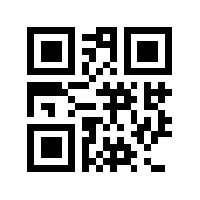

# 9447 CTF 2015: gife cp now

**Category:** Steganography
**Points:** 170
**Solves:** 8
**Description:**

>  See title
> 
>  Hint! For this challenge, one of the qr's is incorrect. It should read '}' instead of '{'
> 
>  Hint! The timing is important. What code uses timing?
> 
>  If it's ambiguous, perhaps a subset of the characters will help.
> 
>  Hint! There was an error with gife up now. It has been corrected. Please download the new gif.
> 
>  Hint! Updated once more. This time is *almost certainly* correct.
> 
> [gife.gif](./gife-489b98cd6221896fa3d10c6dc51e2fb5.gif)  489b98cd6221896fa3d10c6dc51e2fb5


## Write-up

This writeup is based on two writeups. One by [PPP](https://github.com/pwning/public-writeup/tree/master/9447ctf2015/steg170-gife-up-now) and one by [sophia.re](http://www.sophia.re/94472015_gifeupnow_writeup.html).

We are given a gif that displays several QR codes in succession:



The first thing we can do is split the gif into its individual frames using ImageMagick's `convert`:

```bash
+bash-4.3$ convert gife-489b98cd6221896fa3d10c6dc51e2fb5.gif pics/target.png
+bash-4.3$ tree pics
pics
├── target-0.png
├── target-1.png
├── target-10.png
├── target-11.png
├── target-12.png
[...]
├── target-87.png
├── target-88.png
└── target-9.png

0 directories, 89 files
```

Afterwards we can decode the QR codes in a simple manner with [this python script](./qrdecode.py) that uses a python library named `zbarlight`:

```bash
+bash-4.3$ for i in {0..88}; do python2.7 qrdecode.py pics/target-$i.png; done
pics/target-0.png ['two']
pics/target-1.png ['parts']
pics/target-2.png None
pics/target-3.png None
pics/target-4.png None
pics/target-5.png None
pics/target-6.png None
pics/target-7.png None
pics/target-8.png ['lower']
pics/target-9.png None
pics/target-10.png None
[...]
ics/target-80.png None
pics/target-81.png ['faucet']
pics/target-82.png None
pics/target-83.png None
pics/target-84.png None
pics/target-85.png None
pics/target-86.png None
pics/target-87.png None
pics/target-88.png None
```

There are several images that can't be decoded.
Some are just plain white frames, such as `target-10.png` and others just overlay parts of previous frames (Please correct if I am wrong) and are missing some rows, such as `target-85.png`:


We fix the broken QR codes by hand and move the non-white QR codes to another directory for another decoding run:

```bash
+bash-4.3$ mkdir targets
+bash-4.3$ md5 -r pics/* | grep -v 'a8bbd848b849292f9e584276fe4db8ad' | awk '{print $2}' | while read f; do cp "$f" targets/; done                                                                                                                                                                                                                                   
+bash-4.3$ tree targets
targets
├── target-0.png
├── target-1.png
[...]
├── target-81.png
└── target-85.png

0 directories, 26 files
```

Let's run [qrdecode.py](./qrdecode.py) again on the fixed QR decodes to get a hidden hint:

```bash
+bash-4.3$ for i in {0..88}; do [[ -f targets/target-"$i".png ]] && python2.7 qrdecode.py targets/target-"$i".png; done
targets/target-0.png ['two']
targets/target-1.png ['parts']
targets/target-5.png ['all']
targets/target-8.png ['lower']
targets/target-12.png ['add']
targets/target-16.png ['9447{']
targets/target-20.png ['to']
targets/target-21.png ['start']
targets/target-25.png ['and']
targets/target-28.png ['{']
targets/target-32.png ['to']
targets/target-35.png ['the']
targets/target-39.png ['end']
targets/target-43.png ['first']
targets/target-47.png ['looks']
targets/target-48.png ['like']
targets/target-52.png ["'7do'"]
targets/target-55.png ['cut']
targets/target-59.png ['off']
targets/target-63.png ['450ms']
targets/target-67.png ['second']
targets/target-68.png ['like']
targets/target-72.png ['https://www.youtube.com/watch?v=5xxTkB5bGy4']
targets/target-77.png ['like']
targets/target-81.png ['faucet']
targets/target-85.png ['script']
```

As a first hint, we look at [youtube video](https://www.youtube.com/watch?v=5xxTkB5bGy4) that shows us a Tap Dancer.
Given these hints, we find a code named [tap code](https://en.wikipedia.org/wiki/Tap_code) and look at the length of appearance of a given frame:

```bash
+bash-4.3$ for i in {0..88}; do md5 -r "pics/target-$i.png"; done                                                                                                                                                                                                                                                                                                    
fca3afda47eb6351818a39836b638719 pics/target-0.png
6b66d7e0d6d29c7e2f23751afca10d5e pics/target-1.png
a8bbd848b849292f9e584276fe4db8ad pics/target-2.png
a8bbd848b849292f9e584276fe4db8ad pics/target-3.png
a8bbd848b849292f9e584276fe4db8ad pics/target-4.png
06e76fc67f89ac893756b59a1a94e333 pics/target-5.png
a8bbd848b849292f9e584276fe4db8ad pics/target-6.png
a8bbd848b849292f9e584276fe4db8ad pics/target-7.png
3827a3375cce852bbf4e835ebff0da6a pics/target-8.png
a8bbd848b849292f9e584276fe4db8ad pics/target-9.png
a8bbd848b849292f9e584276fe4db8ad pics/target-10.png
a8bbd848b849292f9e584276fe4db8ad pics/target-11.png
[...]
03323555cb7a9c9af0933ad6e2dc7b5c pics/target-77.png
a8bbd848b849292f9e584276fe4db8ad pics/target-78.png
a8bbd848b849292f9e584276fe4db8ad pics/target-79.png
a8bbd848b849292f9e584276fe4db8ad pics/target-80.png
56fbe9555116728e207451eb3d43b463 pics/target-81.png
a8bbd848b849292f9e584276fe4db8ad pics/target-82.png
a8bbd848b849292f9e584276fe4db8ad pics/target-83.png
a8bbd848b849292f9e584276fe4db8ad pics/target-84.png
0e5a5bf5fc79dec20ec46c189c5ff1ff pics/target-85.png
a8bbd848b849292f9e584276fe4db8ad pics/target-86.png
a8bbd848b849292f9e584276fe4db8ad pics/target-87.png
a8bbd848b849292f9e584276fe4db8ad pics/target-88.png
```

The QR Code in `target-0.png` appears for 1 frame, the qr code in `target-1.png` shows for `4` frames in total. `14` in Tapcode is `D`.
Continuing this frame counting method, we get `14 34 44 14 34 34 44 14 34 44 14 54 44`, which is `DOTDOOTDOTDYT`.

One hint in the task description tells us to look at timing.

ImageMagick can also print the [image time delay (in centi-seconds)](http://www.imagemagick.org/script/escape.php) by specifying a format string in ImageMagick's `identify` command:

```bash
:bash-4.3$  identify -format "%s %T\n" gife-489b98cd6221896fa3d10c6dc51e2fb5.gif 
0 50
1 40
2 40
3 50
4 50
5 50
6 50
7 50
8 40
9 40
10 40
[...]
80 50
81 50
82 50
83 50
84 50
85 50
86 40
87 40
88 40
```

There are only two possible values for the delay timing: `400ms` or `500ms`.
One possible option to decode this is translating it from binary to ASCII, another one to see it as morse-code.

The latter is the correct solution:

```bash
+bash-4.3$  identify -format "%T\n" gife-489b98cd6221896fa3d10c6dc51e2fb5.gif | tr -d '0\n' | tr '4' '.' | tr '5' '-' && echo
-..-----...-..--------...-..-----...-..-----...-..--------...-..--------...-..--------...
```

Using only characters `7`, `d` and `o`, as suggested in the QR-decoded message, we get `do7doo7do7do7doo7doo7doo7`.

All that's left to do is concat both hidden messages to get the final flag: `9447{do7doo7do7do7doo7doo7doo7dotdootdotdyt}`

## Other write-ups and resources

* <https://github.com/pwning/public-writeup/tree/master/9447ctf2015/steg170-gife-up-now>
* [sophia.re](http://www.sophia.re/94472015_gifeupnow_writeup.html)
