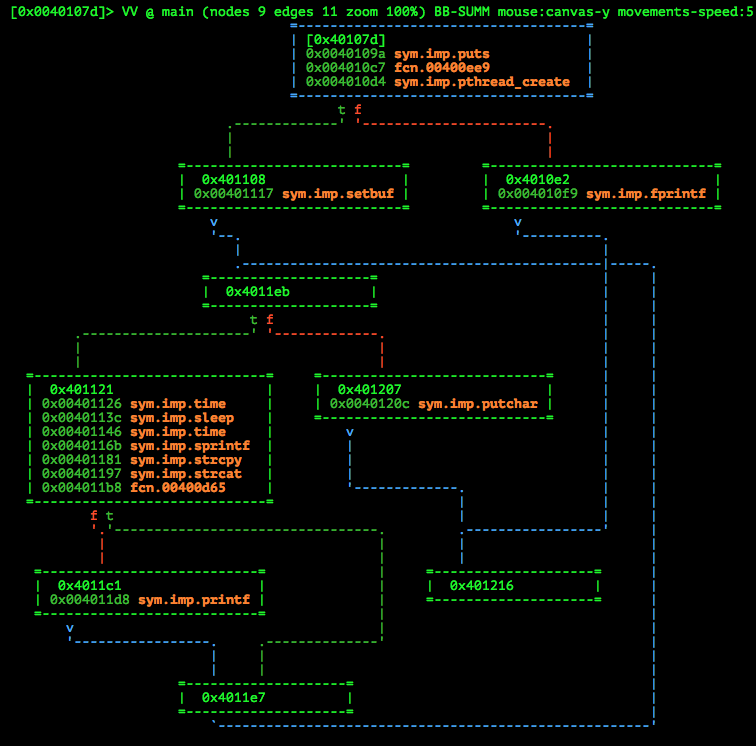
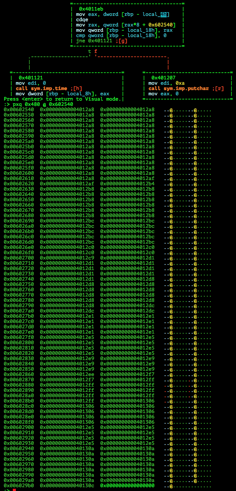
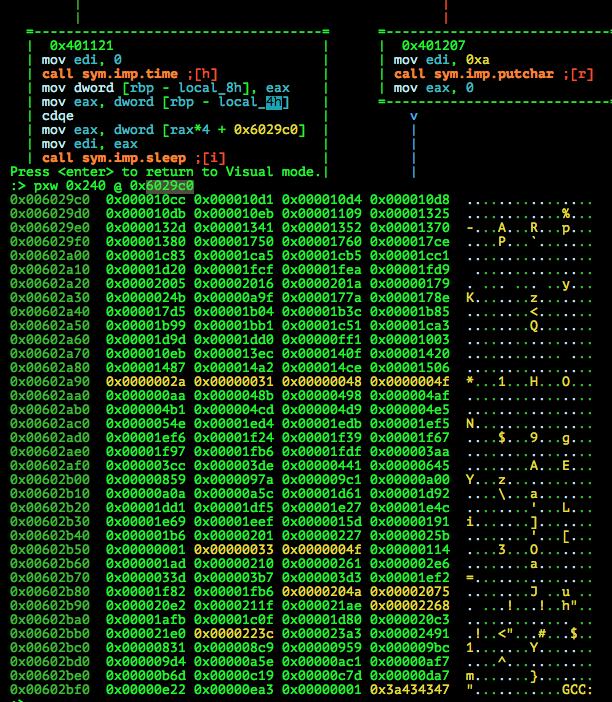
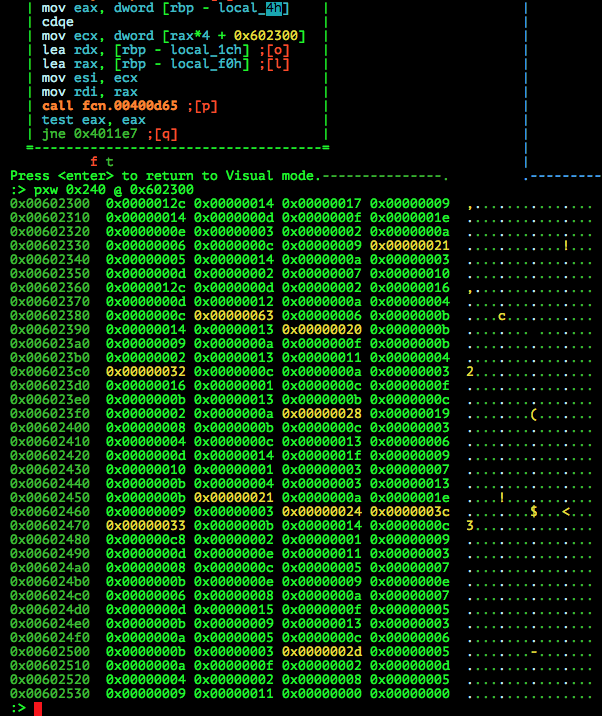

# ASIS Quals CTF 2015: Leach

**Category:** Reverse
**Points:** 250
**Solves:** 58
**Description:**

> Find the flag in this [file](http://tasks.asis-ctf.ir/leach_bc83626319ab77ade5408f6ea222920e).

## Write-up

This writeup is based on following writeups:

* <https://github.com/smokeleeteveryday/CTF_WRITEUPS/tree/master/2015/ASISCTF/reversing/leach> (IDA pseudocode, tables)
* <https://neg9.org/news/2015/5/11/asis-ctf-quals-2015-leach-reversing-250-writeup> (`LD_PRELOAD` trick)
* [Indonesian](https://github.com/rentjongteam/write-ups-2015/tree/master/asis-quals-2015/leach) (`LD_PRELOAD` trick)

by [polym](https://github.com/abpolym)

Keywords:

* `x86-64` Executable for Linux
* `LD_PRELOAD`

We are given a xz-compressed `x86-64` Executable for Linux that we extract using `unxz`:

```bash
$ file leach_bc83626319ab77ade5408f6ea222920e 
leach_bc83626319ab77ade5408f6ea222920e: XZ compressed data
$ unxz < leach* > leach
$ file leach
leach: ELF 64-bit LSB  executable, x86-64, version 1 (SYSV), dynamically linked (uses shared libs), for GNU/Linux 2.6.32, BuildID[sha1]=8088f52df79142c83d3c30224edf2535066a9768, stripped
```

Running it:

```bash
$ ./leach 
this may take too long time ... :)

##############################
#|                          |#
#                            #
#                            #
#                            #
#                            #
#                            #
#       o                    #
#                            #
##############################
```

We open the binary in `radare2` and have a look at the `main` function (in summary visual graph mode):



We can see the following:

* A call to `pthread_create` in the first basic block (`bb`) `0x40107d`
* A big loop from bb `0x4011e7` to bb `0x4011eb`, with bb `0x4011eb` containing the conditional clause to the loop.
* Two `time` and one `sleep` calls as well as several string manipulation function calls and a call to the function `fcn.00400d65` in bb `0x401121`.
* A blind end in bb `0x401216`, which hints at a `ret` instruction call and the end of the function

We run `ltrace` on the binary to get a first impresssion of the called functions and parameters:

```bash
$ ltrace ./leach             #
__libc_start_main(0x40107d, 1, 0x7fff34141078, 0x401220 <unfinished ...>
puts("this may take too long time ... "...this may take too long time ... :)
)           = 35
pthread_create(0x7fff34140e98, 0, 0x400ee9, 0)        = 0
setbuf(0x7f43dfe55400, 0)                             = <void>
time(0)                                               = 1471765605
sleep(4300
##############################
```

As we can see, the `pthread_create` call receives the function `0x400ee9` as `start_routine` parameter. If we look at this function, we can see that it basically just prints out the ping-pong game.
We also can see a `time(0)` and a `sleep(4300)` call.

If you have `IDA`, you can get some pseudocode for the `main` function (as done in [this writeup](https://github.com/smokeleeteveryday/CTF_WRITEUPS/tree/master/2015/ASISCTF/reversing/leach)):

```c
__int64 __fastcall mainroutine(__int64 a1, __int64 a2) {
	(...)
	while ( 1 ) {
		src = off_602540[v13];
		if ( !src ) break;

		v12 = time(0LL);
		sleep(*(&seconds + v13));
		v11 = (unsigned __int64)time(0LL) - v12;

		sprintf(&s, "%d", v11, v4);
		strcpy(&dest, src);
		strcat(&dest, &s);
		if ( !sub_400D65(&dest, (unsigned int)dword_602300[v13], &v8) ) {
			LODWORD(v3) = sub_400DDD(&dest);
			printf(v3);
			dword_602BF8 = 0;
		}
		++v13;
	}
	putchar(10);
	return 0LL;
}
```

In bb `0x4011eb` there is a table lookup (table addr.: `0x602540`) with QWORD values, which we can print using `radare2`:



Since these look like pointers (confirmed using the IDA pseudocode) and later used in `strcpy`, we can print them using `pxQ` to also show the symbol name quickly line by line to see that this table contains pointers to various numbers:


We have a look at another table lookup (table addr.: `0x6029c0`) with WORD values in bb `0x401121`:



Since these values are passed as parameters for the `sleep` function - this is confirmed by converting the parameter of the `sleep` call (Decimal value `4300`, hexadecimal: `0x10cc`) previously seen in the `ltrace` output.

The last table lookup (table addr.: `0x602300`) with WORD values in bb `0x401121`:



We quickly see that the time elapsed between the first `time` call and the second `time` call - with a `sleep` in between them - is string concatted as an integer to the Integer values of the first table `0x602540`.
Afterwards this value as well as the values of the last table `0x602300` are passed as parameters to the `fcn.00400d65` function.

This means that we cannot just null the `sleep` parameter table or `nop` patch the `sleep` call to avoid having to wait for the program to finish.

However, we can use the `LD_PRELOAD` trick (as done in [this](https://neg9.org/news/2015/5/11/asis-ctf-quals-2015-leach-reversing-250-writeup) and [that writeup](https://github.com/rentjongteam/write-ups-2015/tree/master/asis-quals-2015/leach)) to hook the `sleep` and `time` functions:

```c
#include <unistd.h>
#include <time.h>

unsigned int ret = 0;

time_t time(time_t *t) {
        if (t) *t = ret;
        return ret;
}

unsigned int sleep(unsigned int seconds) {
        ret += seconds;
        return 0;
}
```

We compile it to a shared library:

```bash
$ gcc -Wall -fPIC -shared -o hook.so hook.c 
$ file hook.so 
hook.so: ELF 64-bit LSB  shared object, x86-64, version 1 (SYSV), dynamically linked, BuildID[sha1]=6f8c4137833366c3cebc9adca8fa1dcb8af8036e, not stripped
```

We run it to get the flag:

```bash
$ LD_PRELOAD=./hook.so ./leach 
this may take too long time ... :)
ASIS{f18b0b4f1bc6c8af21a4a53ef002f9a2}
```

The flag is `ASIS{f18b0b4f1bc6c8af21a4a53ef002f9a2}`.


## Other write-ups and resources

* <https://github.com/smokeleeteveryday/CTF_WRITEUPS/tree/master/2015/ASISCTF/reversing/leach>
* <https://www.whitehatters.academy/asis-ctf-leach/>
* <http://boaster.github.io/ctf/2015/05/11/ASIS-CTF-Leach.html>
* <https://neg9.org/news/2015/5/11/asis-ctf-quals-2015-leach-reversing-250-writeup>
* [Indonesian](https://github.com/rentjongteam/write-ups-2015/tree/master/asis-quals-2015/leach)
