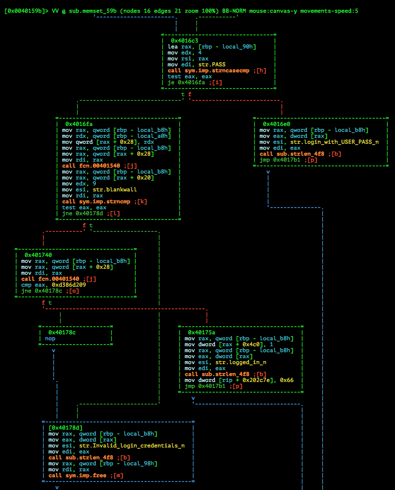
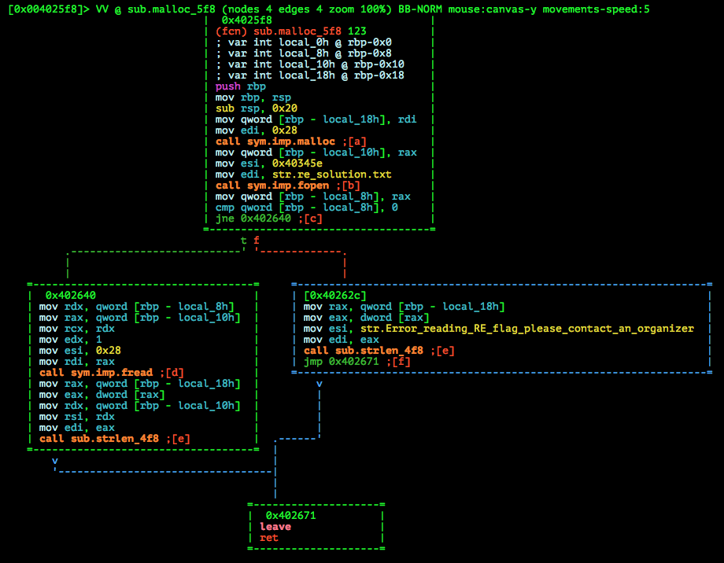
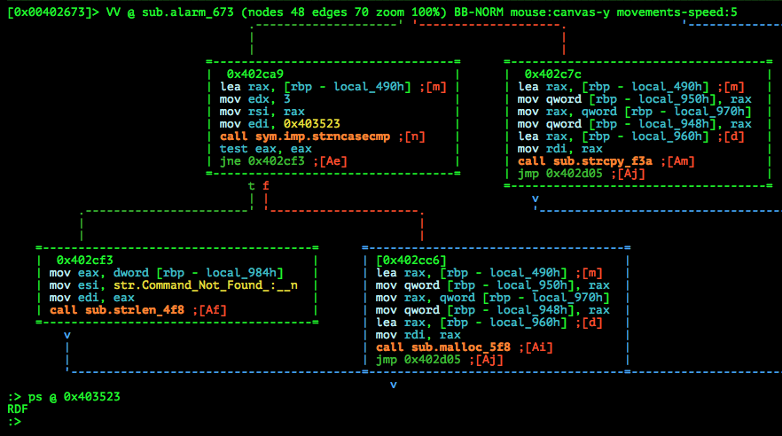

# CSAW QUALS 2015: ftp-300

**Category:** Reversing
**Points:** 300
**Solves:** 214
**Description:**

> We found an ftp service, I'm sure there's some way to log on to it.
>
> nc 54.172.10.117 12012
>
> [ftp_0319deb1c1c033af28613c57da686aa7](ftp_0319deb1c1c033af28613c57da686aa7)
>
>


## Write-up

by [polym]()

Keywords:

* Hardcoded Credentials
* x86-64 Linux
* Custom Authentication Algorithm

We are given a x86-64 Binary for Linux:

```
$ file ftp_0319deb1c1c033af28613c57da686aa7 
ftp_0319deb1c1c033af28613c57da686aa7: ELF 64-bit LSB  executable, x86-64, version 1 (SYSV), dynamically linked (uses shared libs), for GNU/Linux 2.6.32, BuildID[sha1]=43afbcd9f4e163f002970b9e69309ce0f1902324, stripped
```

Running the binary:

```
$ ./ftp_0319deb1c1c033af28613c57da686aa7 
[+] Creating Socket
[+] Binding
[+] Listening
[+] accept loop
```

The binary starts a FTP server, which port we can read by calling the binary with `ltrace` 

```
[pid 4082] __libc_start_main(0x402d2e, 1, 0x7ffff73eda88, 0x402ed0 <unfinished ...>
[pid 4082] signal(SIGALRM, 0x402d19)                                                                                                                                                                                          = 0
[pid 4082] puts("[+] Creating Socket")                                                                                                                                                                                        = 20
[pid 4082] socket(2, 1, 0)                                                                                                                                                                                                    = 3
[pid 4082] puts("[+] Binding")                                                                                                                                                                                                = 12
[pid 4082] bzero(0x7ffff73ed970, 16)                                                                                                                                                                                          = <void>
[pid 4082] htons(0x2eec, 16, 16, 0)                                                                                                                                                                                           = 0xec2e
[pid 4082] htons(0, 16, 16, 0)                                                                                                                                                                                                = 0
[...]
```

The port is `0x2eec` or `12012`, so we connect to the service with `nc` to verify that we deal with a FTP server:

```
$ nc localhost 12012
Welcome to FTP server
HELP
USER PASS PASV PORT
NOOP REIN LIST SYST SIZE
RETR STOR PWD CWD
USER test
Please send password for user test
PASS test
Invalid login credentials
```

Looks like we have to find out how to login / authenticate ourselves.

To do so, we open radare2 in visual mode and press `_` to get all [flags to strings](https://radare.gitbooks.io/radare2book/content/visual_mode/visual_disassembly.html#the-flagcommentfunctions-hud) in order to jump to them:


We jump to the string itself


As we can see, a function named `sub.memset_59b` uses this string (see the red XREF), so we jump to the calling function with `x` and subsequently go back into visual mode to see the following graph:



As we can see, to get to the node `0x40175a`, we have to pass the compares in both nodes `0x4016fa` and `0x401740`.

In the first one, we see that the `USER` is `blankwall`, so we guess that the second node `0x401740` is the function which compares or hashes the `PASS` argument, which should result in `0xd386d209`.

Let's jump to `fcn.00401540` by pressing `gj` (j is the character in the red brackets to the right of the call):


Turn out this is a multiplicative hash function [1](https://github.com/smokeleeteveryday/CTF_WRITEUPS/tree/master/2015/CSAWCTF/reversing/ftp) [2](https://www.strchr.com/hash_functions) on our password (stored in `rdi` and `rbp-0x18`) with initial value of `0x1505` (stored in `rbp-0x4`) and multiplicative value of `0x21` (2^5+1 because of `shl` and the following `add`).

Note that there is modular reduction, meaning that the result stored in `rbp-0x4` is always modulo 2^5, since the `shl eax, 0x5` stores the result as a `DWORD` in `rax` and [nulling the higher 32bits doing so](http://stackoverflow.com/questions/11177137/why-do-most-x64-instructions-zero-the-upper-part-of-a-32-bit-register) [2](http://stackoverflow.com/questions/25455447/x86-64-registers-rax-eax-ax-al-overwriting-full-register-contents?lq=1) [3](http://x86asm.net/articles/x86-64-tour-of-intel-manuals/).

So in total, the python-equivalent of this function is ([source](https://github.com/smokeleeteveryday/CTF_WRITEUPS/tree/master/2015/CSAWCTF/reversing/ftp)):

```
def hashf(inp):
    # Multiplier
    M = 0x21
    # Modulus
    P = 2**32
    # Initial state
    state = 0x1505
    for c in inp:
        state = ((state * M) + ord(c)) % P
    return state
```

We can then use the [Z3 theorem prover](https://github.com/Z3Prover/z3) to find out the correct `inp`ut, since we have all of our constraints stated in the above function.

I tried to solve this keygen on my own using `z3` at first, however I could not get it to work at first. Passwords that matched the hash did lead to the increasingly hated response `Invalid login credentials`.

After reading the writeups mentioned below, I confirmed that I did not miss anything (higher 32 bits are cleared on each mov 32 bit to 64 bit register, shl did zero out higher 32 bits and more special cases checks).
This was done by attaching `gdb-peda` to the child process spawned by the ftp server:

* Start the ftp server
* Run `ps aux | grep ftp`, write down the father pid
* Run `nc localhost 12012` and `ps aux | grep ftp`, write down the child pid
* Attach to the process using `sudo gdb ./ftp_0319deb1c1c033af28613c57da686aa7 -p <child_pid>` ([Note that you need sudo](https://sourceware.org/gdb/onlinedocs/gdb/Attach.html))
* Set a breakpoint to the beginning of the loop inside the hashing function (`0x00401582`)
* Enter `USER blankwall` and `PASS 0123456789` and step through the program, confirming that the registers stay <= `0xffffffff` and higher 32 bits are zeroed out

Then I tried to minimalize some z3 scripts I found in those writeups and finally found the bug in z3 (or maybe its intended): Even though I constraint the value of my BitVector `x` to be printable characters (between `0x20` and `0x7a`), I still have to AND (`&`) the value beforehand with `0xff`. Weird!

The [resulting script](./z3-solve.py) then gave me a password to login with:

```bash
$ python2.7 solve.py 
FTP password is [dNokie]
$ nc localhost 12012
Welcome to FTP server
USER blankwall
Please send password for user blankwall
PASS dNokie
logged in
HELP
USER PASS PASV PORT
NOOP REIN LIST SYST SIZE
RETR STOR PWD CWD
CWD
directory changed successfully
PWD

NOOP
NOOP ok
LIST
use port or pasv first

Command Not Found :(
^C
```

The final step was to find a hidden command not listed when typing in `HELP`.

This is easily done by searching for the string `flag` in the flags to find the String-flag `str.Error_reading_RE_flag_please_contact_an_organizer` and consequently do the same as done in the beginning of this writeup.

We first land in this function:



We jump to the caller (`sub.alarm_673`) to find a hidden command, `RDF`:



We then can execute this command to get the flag:

```
$ nc localhost 12012
Welcome to FTP server
USER blankwall
Please send password for user blankwall
PASS cookie
logged in
RDF
flag{n0_c0ok1e_ju$t_a_f1ag_f0r_you}
```


## Other write-ups and resources

* [http://bruce30262.logdown.com/posts/301425-csaw-ctf-2015-ftp](http://bruce30262.logdown.com/posts/301425-csaw-ctf-2015-ftp)
* <https://github.com/smokeleeteveryday/CTF_WRITEUPS/tree/master/2015/CSAWCTF/reversing/ftp>
* <http://capturetheswag.blogspot.com.au/2015/09/csaw-2015-quals-ftp-re300-challenge.html>
* <https://b01lers.net/challenges/CSAW%202015/FTP/69/>
* <https://wiremask.eu/writeups/csaw-ctf-2015-reverse-300-ftp/>
* <https://github.com/aweinstock314/aweinstock-ctf-writeups/blob/master/csaw_quals_2015/re300_ftp_sploit.py>
