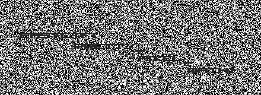

# EasyCTF 2015: Pixels (180)

**Category:** Forensics
**Points:** 180
**Solves:** 
**Description:**

> [mystery1](https://github.com/EasyCTF/easyctf-2015-writeups/blob/master/files/mystery1.png) - [mystery2](https://github.com/EasyCTF/easyctf-2015-writeups/blob/master/files/mystery2.png)
> 
> 
> Hint: Did you know you can do math on images?


## Write-up

This write-up is based on following write-ups:

* <https://github.com/DavidJacobson/EasyCTF-2015-writeup/blob/master/crypto.md#pixels---180-pts>

We are given two pictures:


The hint tells us to do math on the pictures, meaning that we have to subtract, add, multiply or do other operations with the pixel values of both pictures.

We can do that using [ImageMagicks `compose`](http://www.imagemagick.org/Usage/compose/) command with its different [mathematical operators](http://www.imagemagick.org/Usage/compose/#math).

Turns out, we need to use the `difference` operator:

```bash
$ convert mystery1.png mystery2.png -compose minus -composite -colorspace Gray new.png 
```

`new.png`:



The flag is `easyctf{PRETTY_PIXEL_MATH}`.

## Other write-ups and resources

* <https://github.com/EasyCTF/easyctf-2015-writeups/blob/master/pixels_180.md>
