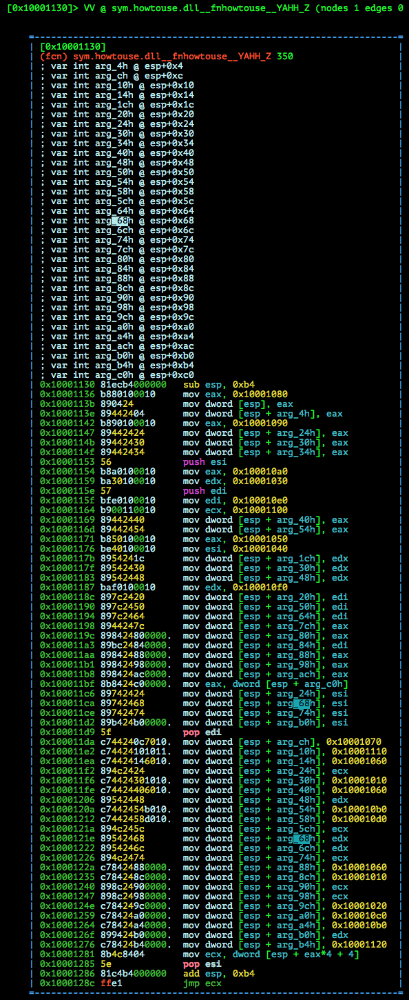

# MMA-CTF-2015: how-to-use-30

**Category:** Reverse
**Points:** 30
**Solves:** 164
**Description:**

> [howtouse](howtouse-8913ee93d7d40c9859ee0a29c456d54ba44aabf78ebdbc4e1be016af62c8a606)


## Write-up

by [polym](https://github.com/abpolym)

Keywords:

* Windows PE32 DLL
* `stdcall` Calling Convention
* `FPO` Frame Pointer Omission

We are given a PE32 executable DLL for Windows:

```bash
$ file howtouse-8913ee93d7d40c9859ee0a29c456d54ba44aabf78ebdbc4e1be016af62c8a606
howtouse-8913ee93d7d40c9859ee0a29c456d54ba44aabf78ebdbc4e1be016af62c8a606: PE32 executable (DLL) (GUI) Intel 80386, for MS Windows
```

Running the binary through `pedump`, we see we deal with a DLL that imports standard functions from `MSVCR90.dll` and `KERNEL32.dll`, while exporting one weirdly named function `?fnhowtouse@@YAHH@Z`:

```bash
$ pedump how.dll 

=== MZ Header ===

                     signature:                     "MZ"
           bytes_in_last_block:        144          0x90
[...]
               Characteristics:       8450        0x2102  EXECUTABLE_IMAGE, 32BIT_MACHINE, DLL
[...]
=== IMPORTS ===

MODULE_NAME      HINT   ORD  FUNCTION_NAME
MSVCR90.dll       276        _lock
MSVCR90.dll        96        __dllonexit
[...]
MSVCR90.dll       16a        _encode_pointer
KERNEL32.dll      1aa        GetCurrentProcessId
[...]
=== EXPORTS ===
[...]
  ORD ENTRY_VA  NAME
    1     1130  ?fnhowtouse@@YAHH@Z
[..,]
```

We disassemble the binary using `radare2` and jump to said function to see the following:



We can see that the function reserves `0xb4` Bytes for local variables as well as the use of the Frame Pointer Omission Optimization, in which local variables are referenced from the current stack pointer (`esp`) position instead of a static stack base pointer (`ebp`).
We can also see several `push` / `pop` instructions, which cause the `esp` to jump 4 Bytes to lower / 4 Bytes to higher addresses respectively. (4 Bytes because we are dealing with a 32-bit binary).

If we have a look at the addresses that are stored into local variables, we can see that each of them are functions that return an ASCII character (except `0x10001000`, which returns 1 and claens the stack by `0xc` Bytes).

Writing down relationships between addresses and ASCII characters we notice something:

```
10001000 -
10001010 a
10001020 b
10001030 c
10001040 d
10001050 e
10001060 f
10001070 A
10001080 M
10001090 0
100010A0 1
100010B0 2
100010C0 3
100010D0 4
100010E0 7
100010F0 8
10001100 9
10001110 {
10001120 }
```

Since flags have the format `MMA{...}`, we guess that the flag is stored in the stack.
Executing the instructions by hand and having `push`/`pop` instructions in mind, we can see the flag:

```
-------------------
esp_new |EDI |ESI |
esp+00h |M   |M   |
esp+00h |A   |{   |
esp+10h |f   |c   |
esp+10h |7   |d   |
esp+20h |9   |0   |
esp+20h |c   |a   |
esp+30h |0   |0   |
esp+30h |1   |f   |
esp+40h |c   |8   |
esp+40h |7   |1   |
esp+50h |2   |4   |
esp+50h |9   |7   |
esp+60h |d   |8   |
esp+60h |8   |d   |
esp+70h |9   |e   |
esp+70h |e   |7   |
esp+80h |e   |f   |
esp+80h |a   |9   |
esp+90h |e   |9   |
esp+90h |b   |3   |
esp+A0h |2   |e   |
esp+A0h |d   |8   |
esp+B0h |}   |    |
esp+B0h |    |    |
[...]
-------------------
```

The flag is `MMA{fc7d90ca001fc8712497d88d9ee7efa9e9b32ed8}`

NOTE: You can also use `angr` to solve the challenge, as seen [here](https://github.com/angr/angr-doc/blob/master/examples/mma_howtouse/solve.py)
## Other write-ups and resources

* <https://github.com/angr/angr-doc/blob/master/examples/mma_howtouse/howtouse.py> - mostly-automated solution using the angr binary analysis framework
* [Japanese](http://charo-it.hatenablog.jp/entry/2015/09/08/005012)
