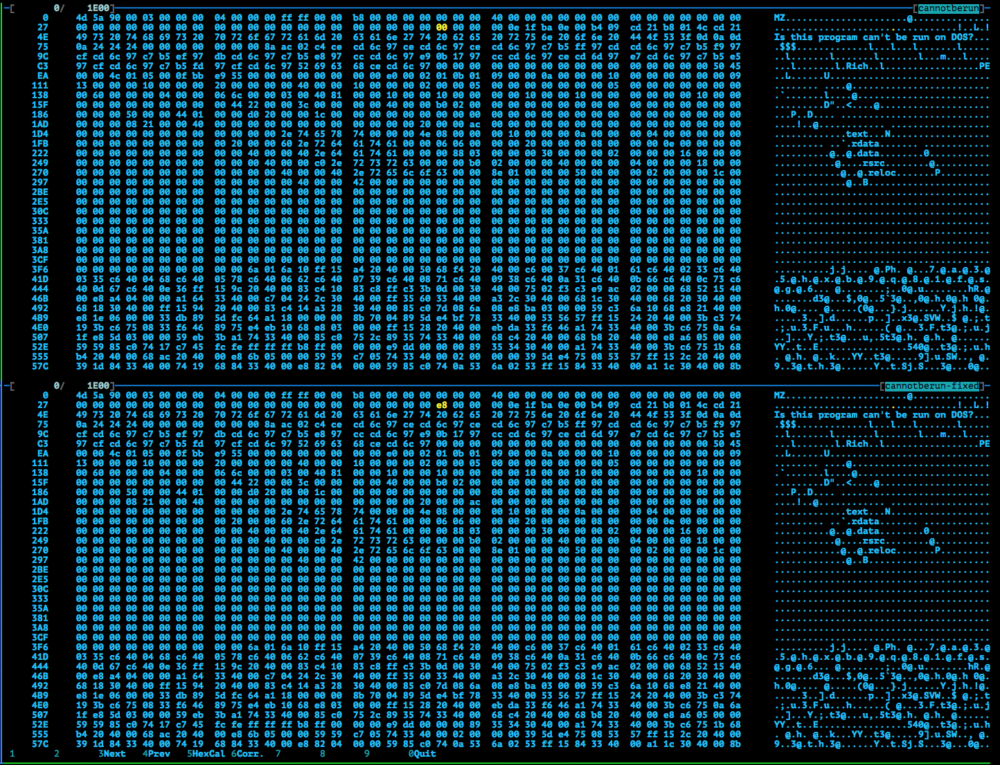

# MMA-CTF-2015: this-program-cannot-run-in-dos-mode-80

**Category:** Reverse
**Points:** 80
**Solves:** 140
**Description:**

> [cannotberun](cannotberun-6a3060f21f87f69f3f67d3077aff51be92db0a71e9d5721aa9e37073abd12b7e)


## Write-up

by [polym](https://github.com/abpolym)

Keywords:

* Windows DOS Executable
* Broken Header

We are given a zip, which we extract to get a Windows DOS program:

```bash
$ file cannotberun-6a3060f21f87f69f3f67d3077aff51be92db0a71e9d5721aa9e37073abd12b7e 
cannotberun-6a3060f21f87f69f3f67d3077aff51be92db0a71e9d5721aa9e37073abd12b7e: Zip archive data, at least v2.0 to extract
$ 7z x cannotberun-6a3060f21f87f69f3f67d3077aff51be92db0a71e9d5721aa9e37073abd12b7e 

7-Zip [64] 9.20  Copyright (c) 1999-2010 Igor Pavlov  2010-11-18
p7zip Version 9.20 (locale=en_US.UTF-8,Utf16=on,HugeFiles=on,1 CPU)

Processing archive: cannotberun-6a3060f21f87f69f3f67d3077aff51be92db0a71e9d5721aa9e37073abd12b7e

Extracting  cannotberun

Everything is Ok

Size:       7680
Compressed: 3439
$ file cannotberun
cannotberun: MS-DOS executable
```

If we try to analyze it either with `pedump` or `radare2`, we get an error or no legible functions:

```bash
$ pedump cannotberun

=== MZ Header ===

                     signature:                     "MZ"
           bytes_in_last_block:        144          0x90
[...]
                        lfanew:          0             0
[?] invalid DOS stub size -64
```

Looking at the hexdump using `hexedit`, we can see whats wrong: The MZ Header / DOS Stub usually contains the start of the PE Header (Bytes `0x3C-0x3F`), but we only see `00 00 00 00` - which means somebody nulled /erased it!

We quickly fix that by finding the start of the PE Header (It begins with `PE`), which is at offset `E8` and change it accordingly as seen in this `dhex` (diff two binaries) output:



Now we can run `pedump` or analyze the binary with `radare2` and find a string using the `V`isual flag hud of `radare2`:

Jumping to the `x`ref of this string, we land in a function that calls printf("The Flag is MMA{%s}", <eaxASCIIcharacters>).
We convert the ASCII characters written to the calloc buffer at `eax` and get the flag:

```bash
$ echo 376133356878623971383166736736 | sed 's/\\x//g' | xxd -r -p && echo
7a35hxb9q81fsg6
```

The flag is `MMA{7a35hxb9q81fsg6}`

## Other write-ups and resources

* <http://fadec0d3.blogspot.com/2015/09/mma-ctf-2015-cannotberun-80.html> 
* <http://boaster.github.io/ctf/2015/09/08/MMA-CTF-RE-80.html>
* [Japanese](http://charo-it.hatenablog.jp/entry/2015/09/08/005012)
