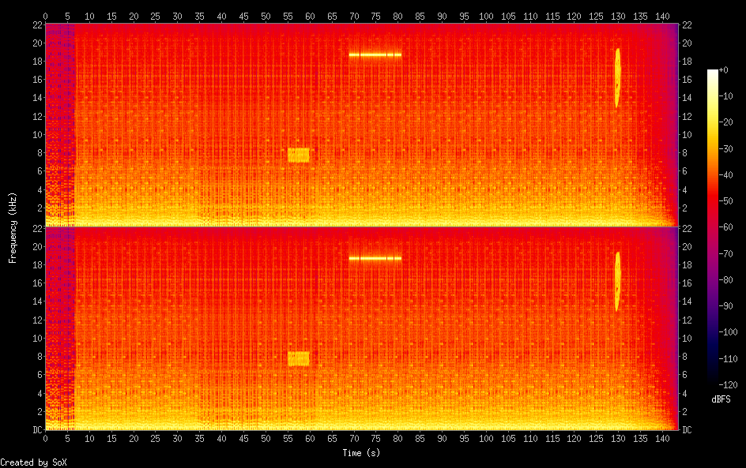
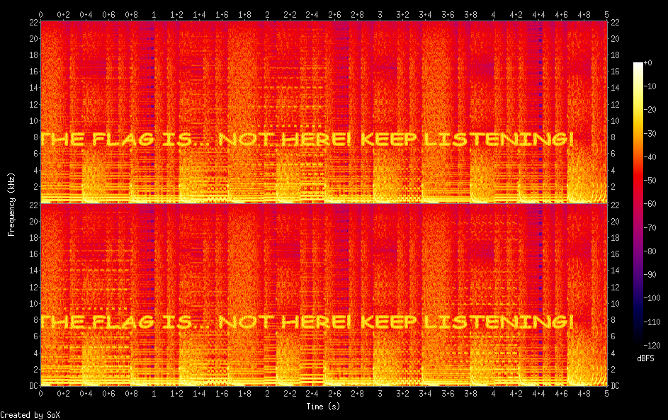
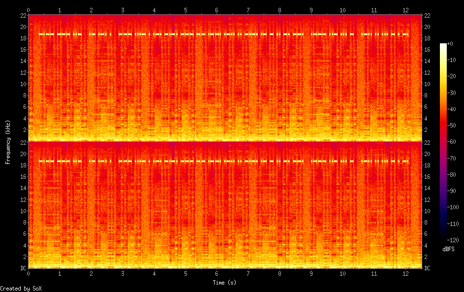
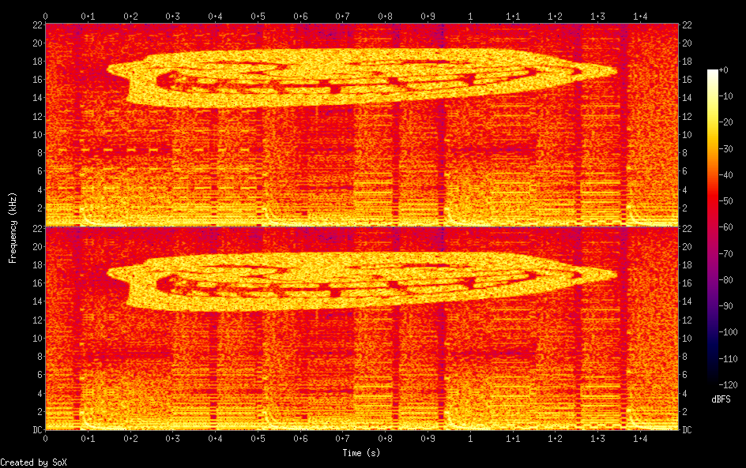

# PoliCTF 2015: It's Hungry

**Category:** Forensics
**Points:** 100
**Solves:** 18
**Description:**

> Old McDonald had a farm. Old McDonald liked chiptune. He also needed to remind its daughter to take care about a zombie animal. But he wanted to do it discreetly, so he wrote this song. Can you find the message? (all lowercase, no spaces) N.B. flag is not in format flag{.+}

## Write-up

This writeup is based on these writeups:

* <http://nandynarwhals.org/2015/07/13/polictf-2015-its-hungry-forensics-100/> 
* <https://zeta-two.com/ctf/2015/07/14/polictf-writeup.html#forensics100-hungry>
* <https://pequalsnp-team.github.io/writeups/its-hungry/>
* <http://b0rk.nl/ctf/2015/polictf/its-hungry.html>
* <http://fadec0d3.blogspot.de/2015/07/polictf-2015-its-hungry-100.html>

We are given a FLAC audio bitstream:

```bash
$ file oldmcdonald.flac
oldmcdonald.flac: FLAC audio bitstream data, 16 bit, stereo, 44.1 kHz, 6323646 samples
```

We can listen to it using `mplayer` or `sox` and hear a pleasant sounding track.

Using `metaflac` or `exiftool` we find the first red herring (Exif data field `Flag`):

```bash
+bash-4.3$ metaflac --list oldmcdonald.flac
METADATA block #0
  type: 0 (STREAMINFO)
  is last: false
  length: 34
  minimum blocksize: 4096 samples
  maximum blocksize: 4096 samples
  minimum framesize: 3729 bytes
  maximum framesize: 14093 bytes
  sample_rate: 44100 Hz
  channels: 2
  bits-per-sample: 16
  total samples: 6323646
  MD5 signature: 74cf7c267ccb4fbec7c6a38297808d8b
METADATA block #1
  type: 4 (VORBIS_COMMENT)
  is last: true
  length: 168
  vendor string: reference libFLAC 1.3.0 20130526
  comments: 7
    comment[0]: GENRE=Chiptune
    comment[1]: TRACKNUMBER=0
    comment[2]: ALBUM=PoliCTF15
    comment[3]: Flag=Yeah, dream on!
    comment[4]: TITLE=oldmcdonald
    comment[5]: DATE=2015
    comment[6]: ARTIST=rbino
+bash-4.3$ exiftool oldmcdonald.flac
ExifTool Version Number         : 9.99
File Name                       : oldmcdonald.flac
Directory                       : .
File Size                       : 18 MB
File Modification Date/Time     : 2015:12:25 14:16:40+01:00
File Access Date/Time           : 2015:12:25 15:23:10+01:00
File Inode Change Date/Time     : 2015:12:25 14:16:40+01:00
File Permissions                : rw-r--r--
File Type                       : FLAC
File Type Extension             : flac
MIME Type                       : audio/flac
Block Size Min                  : 4096
Block Size Max                  : 4096
Frame Size Min                  : 3729
Frame Size Max                  : 14093
Sample Rate                     : 44100
Channels                        : 2
Bits Per Sample                 : 16
Total Samples                   : 6323646
Vendor                          : reference libFLAC 1.3.0 20130526
Genre                           : Chiptune
Track Number                    : 0
Album                           : PoliCTF15
Flag                            : Yeah, dream on!
Title                           : oldmcdonald
Date                            : 2015
Artist                          : rbino
Duration                        : 0:02:23
```

Since this is a forensics challenge, we will first have a look at the [spectrogram](https://en.wikipedia.org/wiki/Spectrogram) to find anything unusual.

This can be done using `sox`'s `spectrogram` effect:

```bash
+bash-4.3$ sox oldmcdonald.flac -n spectrogram
+bash-4.3$ file spectrogram.png 
spectrogram.png: PNG image data, 944 x 593, 8-bit colormap, non-interlaced
```

The spectrogram over all frequencies (here: 0-22000kHz) and the complete time range (here: 0-143s) is the following:



It shows three interesting areas, in which the signal magnitude values (`dBFS`) are exceptionally high (yellow color).

We can create an adjusted spectrogram for each of these areas using `sox`'s trim effect:

`sox oldmcdonald.flac -n trim 55 5 spectrogram -o spectrogram-55-5.png`:



`sox oldmcdonald.flac -n trim 68.5 12.5 spectrogram -o spectrogram-68.5-12.5.png`:



`sox oldmcdonald.flac -n trim 129 1.5 spectrogram -o spectrogram-129-1.5.png`:



The first area/image tells us keep listening, while the third image is just a picture of a troll.

The second image is morsecode:

    -.-- --- ..- .- .-. . --- ...- . .-. -.-. --- -- .--. .-.. .. -.-. .- - .. -. --. .--- ..- ... - .-.. .. ... - . -.

Decoding this morsecode with any [online morsecode decoer](https://gc.de/gc/morse/), we see that it is another decoy/red herring - It says `you are overcomplicating just listen`.

We are told twice now to just listen to the flac itself - so maybe the code is hidden in the notes themselves?

Unfortunately, converting audio to sheet music is a very hard problem, so it has to be done by ear.

To do so, you [one writeup](http://nandynarwhals.org/2015/07/13/polictf-2015-its-hungry-forensics-100/) suggests to use [this 8bit musical sequencer](http://www.pulseboy.com/).

In the end, you'll get [this note sheet](https://zeta-two.com/assets/other/oldmcdonald_score.pdf) - as described in [this writeup](https://zeta-two.com/ctf/2015/07/14/polictf-writeup.html#forensics100-hungry), with the respective notes:

    F4 E4 E4 D4 D4 A4 D4 E4 A4 D4 B3 E E4 F4

The flag is `feeddadeadbeef`.

PS: I can't adjust the frequencies using my sox version, but there is [a patch](http://jdesbonnet.blogspot.de/2014/02/sox-spectrogram-log-frequency-axis-and.html) to adjust the frequency ranges/limit.

## Other write-ups and resources

* <http://nandynarwhals.org/2015/07/13/polictf-2015-its-hungry-forensics-100/> 
* <https://zeta-two.com/ctf/2015/07/14/polictf-writeup.html#forensics100-hungry>
* <https://pequalsnp-team.github.io/writeups/its-hungry/>
* <http://b0rk.nl/ctf/2015/polictf/its-hungry.html>
* <http://fadec0d3.blogspot.de/2015/07/polictf-2015-its-hungry-100.html>
