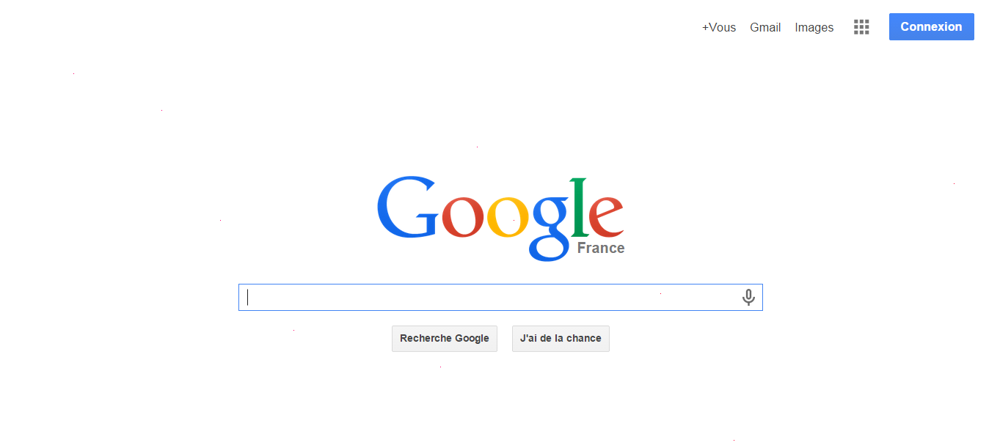

# Securinets Quals CTF 2015: Google

**Category:** Stegano
**Points:** 150
**Solves:** TODO
**Description:** 

> Hint : Useless to google it (Inutile de googler) 
>
> url : [http://41.231.22.133:8030/1/google.png](google.png)

## Write-up

We are given a PNG that display the Google Home Page:



At closer look, we notice some magenta (made out of mixing blue and red values) dots.

We use the [pixels.py](./pixels.py) tool in combination with `grep` to find magenta pixels:

```bash
+bash4.3$ python2.7 ./pixels.py google.png | grep -E '[0-9]+ 0 [0-9]+ [0-9]+'
255 0 112 255
255 0 121 255
255 0 110 255
255 0 53 255
255 0 116 255
255 0 50 255
255 0 49 255
255 0 104 255
255 0 111 255
255 0 48 255
```

The blue values look like they could be represented in ASCII, so let's do exactly that:

```
+bash4.3$ python2.7 ./pixels,py grep -E '255 0 [0-9]+' | awk '{print $3}' | while read d; do printf $(printf '\%o' "$d"); done && echo
pyn5t21ho0
```

This is not the correct flag, but by reordering the alph-numerical characters we can get `python2015`, which is the flag!

## Other write-ups and resources

* <http://ipushino.blogspot.de/2015/03/securinets-ctf-2015-stegano-google.html>