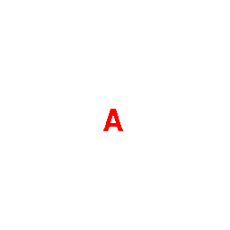
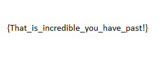

# VolgaCTF Quals CTF 2015: captcha

**Category:** Stego | PPC
**Points:** 150
**Solves:** 145
**Description:**

> We've got a rather strange png file. Very strange png. Something isn't right about it...
> 
> [png](http://files.2015.volgactf.ru/captcha/capthca.png)

## Write-up

We are given a big PNG file and apply `pngcheck` on it to find that it produces an error:

```bash
+bash-4.3$ pngcheck capthca.png 
capthca.png  additional data after IEND chunk
ERROR: capthca.png
```

We can either use a hex editor of our choice or `binwalk` to find that this PNG contains several other PNGs that we then can extract using `foremost`.

All in all, we get around 1900 PNGs, each containing a single character like this one:



Looking at the last PNG, which is a `=`, we are sure that this is a base64 encoded string - the flag.

Before we can apply OCR to get the characters inside each PNG, we might consider hashing all files to reduce the number of possible mistakes by OCR tools:


```bash
+bash-4.3$ md5 -r * | awk '{print $1}' | sort | uniq -c | sort -n
   1 bdbd14948b0daa296ee4cf65e31ade15
   6 66e198735f47802c681c2151ee1090a4
  10 364c1666e2a89a5a64abe2d8e4b69580
  11 e2a7e99259104faabdfa2d26fef87586
  12 633200dd07b7e6197fc256a5fe571fc3
  12 69dc95333d32482337e7ef3c5097f4a3
  12 740d93829104827612a6a65eadb51f8e
  13 c107ea1ce43ef945145fb3f3790efeba
  14 a30d78a371704616a79c59ce20254cb6
  14 ec9e74a5f18847ddf04afe3d4064d22f
  15 20a02330b64a6ac42d84409e7867ff7c
  15 a8d6a8ac9e446affeb4261989a0baf50
  16 75471ca31da82c6f29fc5ec52dcf933f
  17 59a2345aae9ca2dd964ed1b61b0d460f
  18 609f644c2a044c364d5b9d743771de5e
  18 788e99506baca3d86eaad8c70cb84b36
  18 83cd79335ab3a759c99c84951b438838
  18 8d04f1fab0dddf0078a6d484d07f02a0
  18 d2013375b9f3ce21eb7a976e318167fb
  19 471e55d2cc16b3fe059e5ac9db0b31a1
  19 4d54b9e8c5618e1a0a027a35e7e0da3a
  20 18dc10da8f69c7f820964ca96c0831e1
  20 3faed2c01fad265ff59ab4791191b71a
  20 e9036e10c51334f8029929346dad5247
  21 49628fa64b0def5091e08cdd3bf92466
  21 c3214d0a5ab8ebc9f8f5f0416aea3b0d
  21 eb895ce9ad684a436665455f2db6e75d
  21 fde17b9751ca0fd02d103665ee806f24
  22 0757d43ab407cf09795ec741c4baca9c
  22 462b1bf11e61e1b1332e2f8e1c865489
  22 4a0648e7fc1c581fe19b90be6980110e
  22 4c518e3aa75477e98233e6b53e22a6ea
  22 54476bec9c688b7ddd1adc4dd177a30b
  23 0a8d1c7c7a1a3c2fa6570466305f0fd5
  23 2e691ba6943d759011a26c1de27fe70a
  23 644abdaaf808e4a2c75e2f2bcc347d3b
  24 28116c5219fdfe8233c26b5d9a6ba365
  24 7f7dd718aeceb6611edd34be8ee7a764
  24 b9d3f5b5889d10dae01c6f0ba8b5bb81
  25 1d06709d39b274054c8d7c778efaf9d7
  25 553cda794ad7557f8df76e1267c2bf4e
  25 75c2eb65189cbb54e437e139babf9788
  25 861dafbdd50792dc0648224639ce3963
  27 0872c31957efbd5587cdd8f0f3604b06
  28 ab8eec8c6d11e0ae0ae4848977d33c00
  28 df752942d48f765581979acae753ecf7
  29 90852d860e5058ed680ecf4fe3169c30
  29 a9684435587bc1ed84f8de134699b839
  30 0a6a19465a6a764cbea3b3276479db63
  30 8b7ce96904721935d677bc49a698d02e
  30 b33a799e16ead448c784b3fd4b6714b1
  31 52e387013dc79eb6a4f2557a099cd8a0
  32 34446e948f180db5bf8986c5f29a8599
  33 fb98f9311224624c8c36fc7ccfd558c7
  34 83175ff226605efce6dbc3878cee6418
  34 886a6a17d8c57bbc1ed119ea142600f8
  35 4ab6fe2ac42ca0f36a6bf00b291c331c
  37 86817e1c3e6b700f10495c58fcc90f0f
  37 b8c6e1ca952a11cd10096eff68dfdd22
  57 de3b40428ae92e6e76f0e4eb55bb90c4
  59 77c1999c75eacb9fee0b1e9b38a6d2b2
  89 fcb15452ffc5301b316b2ca78b9c3e72
  92 191a934656f747af98996dc86ff7c18f
 116 ca9f9515e27151a05ff3c0ca5c20a1a1
 184 5270cbd314b24e11cec0f03a86d1bf41
+bash-4.3$ md5 -r * | awk '{print $1}' | sort | uniq -c | sort -n | wc
      65     130    2470
```

Looks like we just need to get characters of 65 unique files :).

Using [this python script](./uniques.py), we first a sample PNG for each unique hash and save it to `uniques.txt`:

```bash
+bash-4.3$ python2.7 pyocr.py output/png/ > uniques.txt
```

After that, we apply `tesseract` with pagesegmode `10` (To treat an image as a single character) on [uniques.txt](./uniques.txt) and save the output to [ocr.txt](./ocr.txt)

```bash
+bash-4.3$ cat uniques.txt | awk '{print $1}' | while read f; do tesseract "output/png/$f" txt -psm 10; echo -n "$f " && cat txt.txt; done 2>1 | grep 'png' > ocr.txt
```

Now we can use the `join` command to join the two text files to get a correlation between hash and OCR character:

```bash
+bash-4.3$ join ocr.txt uniques.txt > joined.txt
```

We have to fix some missing character (`j`) in [joined.txt](./joined.txt) and try to build our base64 encoded flag string using [buildflag.py](./buildflag.py):

```bash
+bash-4.3$ python2.7 buildflag.py output/png/ joined.txt 
.VBO.W0KG90AAAANSUhEU9AAA.AAAACDCAIAAADK7dMbAAAAAXNS.0IAFS4C.QAAAA.nQU1BAACXjWV8YQUAAAAJCEhZCWAADSMAAA7DACdVqGQAAAUfSU.BVHhe7dhtYt0WEEV.1SWCWA+FYTNdTOq.hTSjD.NHEmjSe37Z8k9.GV.T.PQBYBmBAQQEBhAQGEBAYAAB9QEEBAYQEBhAQGAAAYEBBAQGEBAYQEB9AAGBAQQEBhAQGEBAYAAB9QEEBAYQEBhAQGAAAYEBBAQGEBAYQEB9AAGBAQQEBhAQGEBAYAAB9QEEBAYQEBhAQGAAAYEBBAQGEBAYQEB9AAGBAQQEBhAQGEBAYAAB9QEEQmD+XM+n0+I8/ZPVB.ZkCSS3/53b5TQ4/fSdjMVf7Zd..Ok7mW.j7/VZb3W.MOU.P.Z.Iq.Vetf+2JKnJZ.IJSDVO30nBOb7NV+ALZj.emAGn283JDe0.qVPjF3U.YIPITDVNVXCUt+JVUB0PVIWP8T4MATmdYZfVDCGPV37Zdjf5WbD5be0O3t0t8/XIW++OmGjSVVm7.jIJq71I0U3SVP1t9/VIX3/S.0+X..1S5V.XC1mSV.ITXTt28X8O1XkbVDfNLUOTBSeFt804.YfNjOZFW+FFG5qSU3GVn1ZLdVq3FPW87CVY8UBGe1VX0.2N507tKf5MkZ2S70VXmqZFeTf59NU/.PefD/P0P.7ZkKN.8GPhVmZfdSJV.Zf+/UnbG.PKOVhkdTNfmPj.+GW.0..57.+2VqSU5dZ.K.MZ0VN3WS7HGW.WbE/3Db../0C1VP9mm3VUU3D8Wbd+CMUHSCV2eW0IZE3CdLb+NXHVtq.7Wm.bCbdPOm+7km.mq0/5S.US7dIUU5jA21Zb.I+1IG7dGPJ00nCNUNd3.PW0K/YTXtS/LCXQ8S/YUZH.Mb.Sf1je+LCOX.tOhDL7C.SMUCmTn0bdXBHm+YTe.FMdbfUMU7FntSF2fPZN.OdVIV0ZdT72EBb1PVXN33eX/+9m.YVOdW1bUP3nWV.1WVG4jbbSH3SO3ZWd/WNk2/q43TmMU.b7k84NC.Z0QendXMPeUSX..UO.7PXN2m.F.3I210ZW//IPtStHIt2.7GBtqW3qXed57VSCF5XE8PjFW7UPkV3.8mmhXWY.X8eb.UQ2UPJ9Wmb.Yb.SCVjCGWbLV3bZCIJBntVXU8VCBMnVXXNPCtmW1DjWFnUIJWU0mbfWDWPG.X/XK.7HfPA/C515jf.JX3VZM3U.jI5.JjWCe.+UZ.fLm.eeqJU37+IW00Zq8mjVhEKmjbSVmhq5CWBVY3V0V8mIVOVB4fnqCVZVXU4VTQt1PFQUIS0j4XH.TUBUT+SW7N/7Ff.8h.Um/P5Xj0m.X/YUW.F7.Dhe1PGQ5MTSSKeJC/TfI.bQTPS.fZNS5.1.fGm7qCbUnSP..3HX8d.PPSPWOCd7NMPSfjJVUCFVOCI9XnNkbDqV+XINWYm7db8qP.K8.dS.fCAT0/8XX2f.5N5eCtLO.j0BYFJU3/..VSEB9CBAQQEBhAQGEBAYAAB9QEEBAYQEBhAQGAAAYEBBAQGEBAYQEB9AAGBAQQEBhAQGEBAYAAB9QEEBAYQEBhAQGAAAYEBBAQGEBAYQEB9AAGBAQQEBhAQGEBAYAAB9QEEBAYQEBhAQGAAAYEBBAQGEBAYQEB9AAGBAQQEBhAQGEBAYAAB9QEEBAYQEBhAQGAAAYEBBAQGEBAYQEB9AAGBAQQEBhAQGEBAYAAB9QEEBAYQEBhAQGAAAYEBBAQGEBAYQEB9AAGBAQQEBhAQGEBAYAAB9QEEBAYQEBhAQGAAAYEBBAQGEBAYQEB9AAGBAQQEBIj28fEX4WPZ1G.2Y.CAAAAASUVO.K5CYII_
```

Since OCR tools are not perfect, we have to check several hash to character translations by hand, especially characters such as `i`, `l`, `I` etc.
We can test on duplicate characters using `cat joined.txt | awk '{print $2}' | sort | uniq -c | sort -n`.

Using our second and final version of [joined.txt](./joined_final.txt), we see that the output, base64 decoded, is a flag inside a PNG:


## Other write-ups and resources

* <https://neg9.org/news/2015/5/3/volga-quals-2015-captcha-stegoppc-150-writeup>
* <http://www.mrt-prodz.com/blog/view/2015/05/volgactf-2015-quals---captcha-150pts-writeup>
* <https://www.whitehatters.academy/volgactf-2015-captcha/>
* <http://capturetheswag.blogspot.com.au/2015/05/captcha-weve-got-rather-strange-png-file.html>
