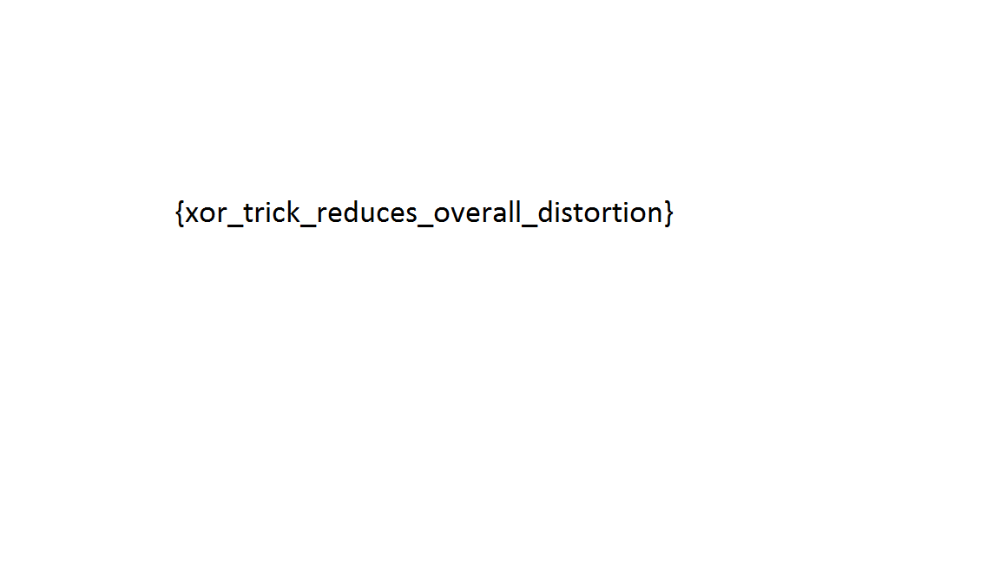

# VolgaCTF Quals CTF 2015: tlsb

**Category:** Stego
**Points:** 400
**Solves:** 4
**Description:**

> There must be a hidden message somewhere.
> 
> [stego](http://files.2015.volgactf.ru/tlsb/stego.png)
> 
> Hints
> 
> 2 bpp. That's incredible.
> 
> 2x3 matrix embedding.
> 
> Jessica Fridrich would solve this task easily.

## Write-up

This writeup is based no a writeup by [whitehatters](https://www.whitehatters.academy/volgactf-2015-tlsb/).
Also can be read [here](http://www.symbiosysconsulting.com/articles/intro-to-stenography).

The title and hints of this task refer to hiding data in the [least significant bit](http://www.lia.deis.unibo.it/Courses/RetiDiCalcolatori/Progetti98/Fortini/lsb.html) by applying a 2x3 matrix embedding to achieve storing 2 `bpp` - bits per pixel.

The hints suggest to read a paper by [Jessica Fridrich](http://ws.binghamton.edu/fridrich/Research/large_payloads-spie.pdf), but the most helpful paper is actually a paper by [Andreas Westfeld](http://www2.htw-dresden.de/~westfeld/publikationen/21370289.pdf).

In the section `Matrix encoding`, we read following:


We try to retrieve the stored bits `x1` and `x2` from the least significant bits (lsb) of the red (`a1`), green (`a2`) and blue (`r3`) values.

This is done using [this python script](./tlsb-stego.py):

```bash
+bash-4.3$ python2.7 tlsb-stego.py stego.png out.bin
```

The resulting output `out.bin` is a PNG:

```bash
+bash-4.3$ file out.bin
out.bin: PNG image data, 1152 x 648, 8-bit/color RGB, non-interlaced
```

We open it and see the flag:



## Other write-ups and resources

* <https://www.whitehatters.academy/volgactf-2015-tlsb/> or [here](http://www.symbiosysconsulting.com/articles/intro-to-stenography)
